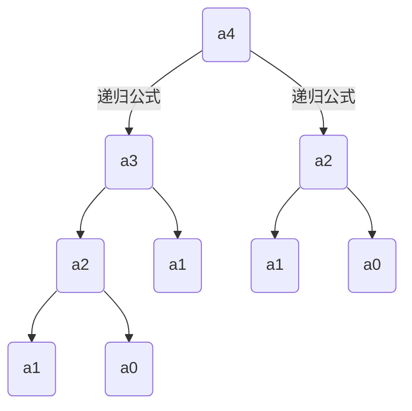

# java语言概述

## java语言版本迭代

JDK1.5，为突出此版本的主要性，更名为JDK5.0

名字的更换：J2SE -> JavaSE，J2EE -> JavaEE，J2ME -> JavaME

发布JDK 8.0，是继JDK 5.0以来变化最大的版本

## Java语言应用领域

Java Web开发：后台开发

大数据开发

Android应用程序开发：客户端

## DOS 命令


补充：

```
某盘： -->进入某盘
cd\目录名1\目录名2  -->直接进入目录2
del 目录名  -->删除该目录下的所有文件
del *.文件类型 -->删除所有该类型的文件
```

注意：

rd删除目录，需要该目录没有文件

##  java核心机制

- java虚拟机（JVM）

  > 负责执行指令，管理数据、内存、寄存器

- 垃圾收集机制

  > 对不再使用的内存空间自动回收

## Java环境搭建

### JDK 

> Java开发工具包 

JDK = JRE + 开发工具集

- JRE

  > Java运行环境

  JRE = JVM (虚拟机)+ Java SE标准类库

- 开发工具集

  - javac.exe 用于编译 

  - java.exe 用于运行

  - javadoc.exe 生成网页版文档

## 注释(comment)

- 单行注释：  //

- 多行注释：  /*       */

- 文档注释：

  > 注释内容可以被JDK提供的工具 javadoc 所解析，生成一套以网页文件形式体现的该程序的说明文档。


 	

## 编程风格


## 编译和运行

###编译

​	使用程序：javac.exe

​	格式：

```java
 javac 文件名.java //.java文件变为.class文件（字节码文件），程序有多少个类就有多少个字节码文件
```

###运行

​	使用程序：java.exe

​	格式: 

```java
 java 类名 //运行有main方法的那个类
```


#java基本语法

##public类和程序入口

###public类:

一个源文件中可以有多个类(calss)，但**最多只能有一个public类**。其它类的个数不限。

如果源文件包含 一个public类，则**文件名必须按该类名命名**。

###程序入口：

应用程序的执行入口是main()方法，有固定写法：

```java
public class Hello{  //文件名必须为 "Hello"
    public static void main(String[] args){
        
    }
}
class World{
    //可以有多个类
}
```

## 输出语句

```java
System.out.println(); //先输出后换行
Sytem.out.print(); //只输出不换行
```

## 输入语句

实现步骤：

1、导包：  import java.util.Scanner;

2、Scanner的实例化：Scanner scan = new Scanner(System.in);

3、调用Scanner类的相关方法，获取指定类型的变量

​	注意：没有对应的方法取获取char类型的数据

```java
import java.util.Scanner;

class VariableTest{
    public static void main(String[] args){
        Scanner scan = new Scanner(System.in);
        int age = scan.nextInt(); //获取整数
        double weight = scan.nextDouble();//获取浮点型数据
        String name = scan.next();//获取字符串
        Boolean isLove = scan.nextBoolean();//获取Boolean类型数据
    } 
}

```

## 关键字和保留字

###关键字（keyword）：

用做专门用途的字符串


###保留字（reserved word）：

现有Java版本尚未使用，但以后版本可能会作为关键字使 用。自己命名标识符时要避免使用这些保留字

goto 、const

##标识符命名规则

定义规则：


## 标识符命名规范


## 变量

### 变量使用注意点

- Java中局部变量必须先声明和赋值，才能使用

- 变量的作用域：其定义所在的一对{ }内

- 变量只有在其作用域内才有效

- 如果变量重名，需要求两者的作用域不能有交集

### 变量的分类

- 基本数据类型
  - 整数类型——byte，short，int，long
  - 浮点类型——float，double
  - 字符型——char
  - 布尔类型——boolean
- 引用数据类型
  - 类——class
  - 接口——interface
  - 数组——[]

## 整数类型

byte——1字节＝8bit位

short——2字节

int——4字节

long——8字节

​	**注意**：声明long类型时，必须以"l"或"L结尾"

```java
long a=1234L;
```

##浮点类型

float——4字节

double——8字节

​	**注意：**

- float:单精度，尾数可以精确到7位有效数字。

- double:双精度，精度是float的两倍。

- Java 的浮点型常量默认为double型，声明float型常量，须后加‘f’或‘F’。

```java
float a=123.4f;
```

##字符类型

> 1字符（2字节）

### 字符型变量的三种表现形式

​        声明一个字符

```java
char c1='a';
```

​        转义字符

```java
char c2='\n';
```

​         直接使用 Unicode 值来表示字符型常量：‘\uXXXX’。

```java
char c3='\u0043'; \\表示字符 c
```

##布尔类型

boolean类型数据只允许取值true和false，无null。

不可以使用0或非 0 的整数替代false和true

## 字符串类型

String不是基本数据类型，是一个类

初始化格式：

```java
方式一：String str = “abcd”;
方式二：String str = new String("abcd");
```

可以和任何基本数据类型做连接，但结果是String类型

##基本数据类型转换:

### 自动类型转换


- **注意：**

运算时，系统首先将参与运算的数据自动类型转换成两者级别最高那种数据类型，然后再进行计算；

byte,short,char之间不会相互转换，他们三者在计算时首先转换为int类型；

boolean类型不能与其它数据类型运算；

当把任何基本数据类型的值和字符串(String)进行连接时(+)，基本数据类型的值将自动转化为字符串(String)类型。

- **易错点：**

```java
int num=10;
char c='a';
String str1="Hello";
System.out.println(c+num+str1); //结果为：107Hello  先做加法运算，再做连接
System.out.println(num+str1+c); //结果为：10Helloa  只做连接
```

```java
System.out.println('*'+'\t'+'*'); //只做加法运算，转成int型做加法运算   结果为： 93
System.out.println('*'+"\t"+'*'); //只做连接，结果为： *  *
System.out.println('*'+'\t'+"*"); //先转成int型做加法运算，后做连接  结果为： 51*
```

**总结：**

分清是加法运算还是连接（有字符串出现则是连接，否则为加法运算）；

加法运算要注意自动类型转换（尤其是char,byte,short型出现在运算都先转换为int型）；

### 强制类型转换:

使用时要加上强制转换符：()

可能造成精度降低或溢出

boolean类型不可以转换为其它的数据类型

```java
float num=1.2f;
int a=(int)num;
```

## 进制

二进制(binary)：0,1 ，以0b或0B开头；

十进制(decimal)：0-9

八进制(octal)：0-7 ，以数字0开头表示

十六进制(hex)：0-9及A-F，以0x或0X开头表

## 运算符

###算数运算符


- **取模运算：**

取模运算结果的符号与被模数的符号相同 

- **自增自减：**

(前)++  ：先自增1，后完成当前命令

(后)++  ：先完成当前命令，后自增1

```java
int a=10;
int b=++a; //b为11

int a1=10;
int b1=a++; //b为10
```

```java
int n1 = 10;
n1 += (n1++) + (++n1); //结果为32
```

自增自减不会改变变量本身的数据类型

```java
short a=10;
a++; //此时a依然为short型，区别于 a = a + 1
```

### 赋值运算符

符号：=

支持连续赋值

```java
int i,j;
i = j = 10; //连续赋值

//int i = j = 10; //编译出错，没有定义j的类型
```

当“=”两侧数据类型不一致时，可以使用自动类型转换或使用强制 类型转换原则进行处理。

扩展赋值运算符： +=, -=, *=, /=, %=（不改变变量本身的数据类型）

```java
 short num = 12;
 num %= 5;   //num依然为short类型

int num1=1;
num1 *= 0.1; //num依然为int类型 ，故结果为0   
```

### 比较运算符


比较运算符的结果都是boolean型，也就是要么是true，要么是false

### 逻辑运算符


逻辑运算符操作的都是boolean类型的变量

- “&”和“&&”的区别：

​	单&时，左边无论真假，右边都进行运算；

​	双&时，如果左边为真，右边参与运算，如果左边为假，那么右边不参与运算

- “|”和“||”的区别:

​	单|时，左边无论真假，右边都进行运算；

​	双||时，如果左边为假，右边参与运算，如果左边为真，那么右边不参与运算

### 位运算符


位运算是直接对整数的二进制进行的运算

- <<  ：在一定范围内，每向左移一位，相当于 *2

- \>> ：在一定范围内，每向有移一位，相当于 /2

### 三元运算符


表达式1和表达式2的结果**都会自动转为两者类型中的级别最高的那种类型**

```java
int num1=2;
int num2=5;
double a = (num1 > num2)? 1 : 2.3; //1和2.3都能统一为double类型
```

可以嵌套使用：

```java
String str1 = (n1 > n2)? "n1 > n2" : ((n1 == n2)? "n1 = n2" : "n1 < n2");
```

### 运算优先级

不需要记，需要优先算的就用 '()'


##基本流程结构

### 顺序结构

程序从上到下逐行地执行，中间没有任何判断和跳转

### 分支结构

- **if…else结构：**

当多个条件是“互斥”关系时，条件判断语句及执行语句间顺序无所谓 

当多个条件是“包含”关系时，“小上大下 / 子上父下”

```java
int age = 45;
if(age > 0 && age <= 18){
    System.out.println("儿童");
}else if(age < 30){
     System.out.println("青年");
}else if(age < 45){
     System.out.println("成年");
}else{
     System.out.println("老年");
}
```

当没有 {} 表明else附属哪个if时，else采用就近原则，如下：

```java
int x = 4;
int y = 1;
if(x > 2)
    if(y > 2)
        System.out.println("Hello");
	else  //采用就近原则
        System.out.println("World");
```

- **switch-case结构：**

```java
switch(表达式){
    case 常量1:
        语句1;
        break;
    case 常量2;
        语句2;
        break;
    default:
        语句;
        break;
}
```

 switch(表达式)中表达式的值**必须**是下述几种类型之一：byte，short， char，int，枚举 (jdk 5.0)，String (jdk 7.0)；

 case子句中的值必须是**常量或常量表达式**，不能是变量名或不确定的表达式值

default子句可有可无，当没有匹配的case时， 执行default字句后者直接跳出switch

当写分支结构时，当发现既可以写switch-case（case的情况不多），有可以使用if - else时，优先使用switch-case

### 循环结构

- **循环语句的四个组成部分：**

​	初始化部分

​	循环条件部分

​	循环体部分

​	迭代部分

- **for循环：**

语法格式：

for (①初始化部分; ②循环条件部分; ④迭代部分)｛ 

​			③循环体部分; 

｝	

 执行过程：

①-②-③-④-②-③-④-②-③-④-.....-②

- **while循环：**

语法格式：

①初始化部分

 while(②循环条件部分)｛

 		③循环体部分; 

​		④迭代部分;

 }

 执行过程：

①-②-③-④-②-③-④-②-③-④-.....-②

for循环和while循环的执行过程一样因此可以相互替换

- **do-while循环：**

①初始化部分;

 do{ 

​			③循环体部分；

​	 		④迭代部分 ；

​		}while(②循环条件部分);

执行过程：

①-③-④-②-③-④-②-③-④-...②

和 for 、while的唯一区别在于do-while循环至少执行一次循环体。因此当执行多次循环时，三者无区别可以相互替换。

- **结束循环的两种方式**

1、循环条件不满足

2、break退出循环

### break

使用范围：switch语句和循环语句

默认跳出包裹此关键字最近的一层循环

### 带标签的break

结束指定标识的一层循环结构

```java
lable:for(   ){
    
    for(   ){
        
        if(  ){
            break lable;
        }
    }
}
```


### continue

执行过程：跳过循环体，执行迭代部分，进入下一次循环的条件判断

使用范围：for语句（不能用于while和do-while语句，因为continue找不到迭代部分，从而陷入无限循环）

默认跳出包裹此关键字最近的一层的当次循环

### 带标签的continue

结束指定标识的一层循环的当次循环

```java
lable:for(   ){
    
    for(   ){
        
        if(  ){
            continue lable;
        }
    }
}
```


## 数组

### 数组的特点

- 数组本身是**引用数据类型**，而数组中的元素可以是任何数据类型，包括基本数据类型和引用数据类型。
- 创建数组对象会在内存中开辟一整块**连续的空间**
- 数组的**长度一旦确定，就不能修改**

### 一维数组的使用

- 声明和初始化

  - 声明：type var[] 或 type[] var；

    ```java
    int[] array1;
    int array2[];
    ```

    声明和初始化可以放在一条语句

  - 初始化

    - 动态初始化：数组声明（在栈中建立数组变量）且为数组元素分配空间（在堆中分配空间）与赋值的操作分开进行

      ```java
      int[] arr1 = new int[3];//数组声明且为数组元素分配空间
      arr[0] = 3;//赋值的操作方式1
      arr[1] = 9;
      arr[2] = 8;
      arr = new int[]{3,9,8};//赋值操作方式2
      ```

    - 静态初始化：数组声明（在栈中建立数组变量）且为数组元素分配空间（在堆中分配空间）与赋值的操作同时进行

      ```java
      int[] arr1 = new int[]{1,2,3};//方式1
      int[] arr2 = {3,9,8};//方式2 --> 类型推断
      ```

- 内存解析

  ```mermaid
  graph LR
  	subgraph 栈
  		a(数组变量)
  	end
  	subgraph 堆
  		a --> b(数组内存0)
  		 c(数组内存1)
  		 d(数组内存2)
  		e(.......)
  	end
  ```

  

- 获取数组长度：（数组长度一旦确定就不能改变）

  数组名 . length

- 数组元素的默认初始化值

  


### 二维数组的使用

- 声明和初始化

  - 声明：type var[][] \[][]或 type\[][] var；

    ```java
    int[][] array3;
    int array4[][];
    ```

  - 初始化

    - 动态初始化：数组声明（在栈中建立数组变量）且为数组元素分配空间（在堆中分配空间）与赋值的操作分开进行

      ```java
      int[][] array5 = new int[3][3];//方式1
      //int[][] array5 = new int[3][];//方式2
      array5 = new int[][] {{1,2,3},{3,4},{5,6}};//赋值方式1
      ```

      

    - 静态初始化：数组声明（在栈中建立数组变量）且为数组元素分配空间（在堆中分配空间）与赋值的操作同时进行

      ```java
      int[][] array = new int[][] {{1,2,2},{3,4,5}};//方式1
      		int[][] array1 = {{1,2},{3,45,6},{5,6,7}};//方式2
      ```

      由方式2可见：**Java中多维数组不必都是规则矩阵形式**

- 获取数组长度：

  数组名 . length （数组长度一旦确定就不能改变）

  ```java
  int[][] array1 = {{1,2},{3,4,6},{5,6,7}};
  array1.length;//外层数组的元素个数，结果为3
  array1[0].length;//内层数组的元素个数，结果为2
  array1[1].length;//内层数组的元素个数，结果为3
  ```

- 数组的遍历

  ```java
  int[][] array = {{1,2},{3,4,6},{5,6,7}};
  for(int i = 0;i < array.length;i++){
      for(int j = 0;j < array[i].length;j++){
          System.out.println(array[i][j]);
      }
  }
  ```

- 内存解析

  ```mermaid
  graph LR;
  	subgraph 栈
  		a(数组变量)
  	end
  	subgraph 堆
  		a --> b(外层数组内存0--存放内层数组地址)
  		a --> c(外层数组内存1--存放内层数组地址)
  		a --> d(外层数组内存2--存放内层数组地址)
  		
  		b --> f(内存数组内存0)
  		f -.- g(内存数组内存1)
  		g -.- h(....)
  		
  		c --> i(内存数组内存0)-.-j(内存数组内存1) -.- k(....)
  		
  		d --> l(内存数组内存0) -.- m(内存数组内存1) -.- n(...)
  		
  	end
  ```


- 数组元素默认初始化值

  - 初始化方式一：int\[][] array = new int \[3] [3];

    外层元素初始化值为：地址值

    内层元素初始化值为：与一维数组初始化情况相同

  - 初始化方式二：

    int\[][] array5 = new int\[3] [ ];

    外层元素初始化值为：null

    内层元素初始化值为：不能调用，否则报错

  ​	

### Arrays工具类的使用


```java
import java.util.Arrays;
……

int[] array = new int[] {1,4,3,8};
int[] array1 = new int[] {2,4,1,5};
boolean isEqual = Arrays.equals(array1);
```

```java
import java.util.Arrays;
……

int[] array = new int[] {1,4,3,8};
System.out.println(Arrays.toString(array));
```

```java
import java.util.Arrays;
……

int[] array = new int[] {1,4,3,8};
Arrays.fill(array,10);
```

### 数组使用中的常见异常

- 数组脚标越界异常(ArrayIndexOutOfBoundsException)

  访问到了数组中的不存在的脚标时发生

- 空指针异常(NullPointerException)

  引用本身为空，却调用相关的属性或方法

  三种情况如下：

  ```java
  int[] arr = null;
  System.out.println(arr[0]);
  ```

  ```java
  int[][] arr = new int[3][];
  System.out.println(arr[1][2]);
  ```

  ```java
  int[][] arr = new int[3][];
  System.out.println(arr[1].toString());
  ```

  

# 面向对象（上）

## 类

### 类的成员

- 属 性：对应类中的成员变量（可以为任意类型）
- 行 为：对应类中的成员方法
- 构造器
- 代码块
- 内部类

### 类的语法格式

```java
修饰符 class 类名 {
            属性声明;
            方法声明;
		}//当修饰符为public时，类可以被任意访问
```

### 属性（成员变量） vs 局部变量：

- 属性：
  - 直接定义在类的一对{}内
  - 有权限修饰符指明其权限（private、public、缺省、projected）
  - 根据其类型都有默认初始化值
  - 加载到堆空间（非static）
- 局部变量：
  - 声明在方法内、方法形参、代码块内、构造器形参、构造器内部的变量
  - 不可以使用权限修饰符
  - 没有默认初始化值
  - 加载到栈空间

### 方法

- 方法的声明格式：

  ```java
  权限修饰符 返回值类型 方法名（形参列表）｛
  		方法体
  		return 返回值;
  ｝
  ```

- 形参：可以是任意数据类型（基本数据类型和引用数据类型）

- return关键字：

  - 使用范围：方法体内
  - 作用：1、结束循环。2、针对有返回值类型的方法，返回数据。

- 注意点：

  - 方法在使用中可以调用当前类的属性或方法

    特殊的：方法A中又调用方法A：递归

  - 方法中，不可以定义方法

### 构造器

- 作用：创建对象；初始化对象属性

- 语法格式：

  ```java
  权限修饰符 类名 (参数列表) {
  		初始化语句；
  	}
  ```

  

- 分类：

  - 隐式无参构造器（系统默认提供）

  - 显式定义一个或多个构造器（无参、有参）

    - 无参构造器功能：创建对象

    - 有参构造器功能：创建对象并初始化其属性

      ```java
      ...
      People a = new People("朱博能",21);
      ...
      class People{
      	public People(String str,int i) {
      		name = str;
      		age = i;
      	}
      	int age;
      	String name;
      	
      }
      ```

- 说明：

  - 一个类可以创建多个重载的构造器
  - 一旦显式定义了构造器，则**系统不再提供默认构造器**

## 对象

类的实例化

### 创建对象语法

- 类名 对象名 = new 构造器;

```java
Person p1 = new Person();//创建Person类对象
```

- 如果创建了一个类的多个对象，每个对象都独立的拥有一套类的属性

### 访问对象成员语法（包括属性和方法）

- 对象名.对象成员

```java
p1.name = "朱博能";//访问属性
p1.run;//访问方法
```

### 内存解析

- 堆存放**对象实体**

- 虚拟机栈用于存储**局部变量**

- 方法区用于存储已被虚拟机加载的**类信息、常量、静态变量、即时编译器编译后的代码**等数据。

### 匿名对象

- 说明：创建的对象没有显式的赋给一个变量名。

- 特征：匿名对象只能调用一次，每次调用匿名对象都会产生新的对象实体

  ```java
  ....
  new Student().age = 15;
  System.out.println(new Student().age);//结果为0，因为两次对应的对象实体并不是同一个
  ....
  
  class Student{
      int age;
  }
  ```

- 使用：通过方法使匿名对象实体多次调用（往往用在形参使类的情况下）

  ```java
  public class NoNameClass {
  	public static void main(String[] args) {
  		People a = new People();
  		a.usePhone(new Phone());//将匿名对象的地址赋给方法的形参变量phone，从而实现对匿名对象的多次调用
  	}
  }
  
  class Phone{
  	public void call() {
  		System.out.println("拨打电话");
  	}
  	public void playGames() {
  		System.out.println("打游戏");
  	}
  }
  
  class People{
  	public void usePhone(Phone phone) {
  		phone.call();//调用次数1
  		phone.playGames();//调用次数2
  	}
  }
  ```

## 方法的重载

- 定义：在同一个类中，允许存在一个以上的同名方法，只要它们的参数个数或者参数 类型不同即可。
- 判断同名方法合法性：根据重载的定义，只同时满足以下两个条件即可
  - 两个同名方法在同一个类中
  - 两个同名方法参数个数或者参数 类型不同
- 通过对象调用方法时，由于方法重载存在，因此除了需要看方法名，还需要看参数列表

## 可变个数的形参

- 声明格式：方法名(参数的类型名 ...参数名)

- 意义：传给方法的指定类型的实参个数是可变的：0个，1个或多个

- 可变个数形参的方法与同名的方法之间，彼此构成重载

- **可变个数的形参的使用和数组是一致的**

- **可变形参需放在方法参数列表的最后一个**

- **在一个方法中，最多只能声明一个可变个数形参**

  ```java
  public class ChangeParameter {
  	public static void main(String[] args) {
  		People a = new People();
  		a.eat("rice","noodle","……");
  	}
  }
  class People{
  	public void eat(String...str1) {
  		for(int i = 0;i < str1.length;i++) {
  			System.out.print(str1[i]+" ");//使用方法和数组一致
  		}
  	}
  }
  ```

  

## 方法参数的值传递机制

### 关于变量的赋值

- 如果变量是基本数据类型，则赋值的是变量所保存的数据值
- 如果变量是引用数据类型，则赋值的是变量所对应的数据的地址值

### 值传递机制

- 如果形参是基本数据类型，此时实参赋给形参的是实参真实存储的数据值
- 如果形参是引用数据类型，此时实参赋给形参的是实参对应的数据的地址值 

## 递归方法

定义：一个方法体内调用它自身

使用条件：

- 要有终止条件
- 要有递归体——调用自身方法，且形参要有递归变化

```java
/**
 * 	f(0) = 1,f(1) = 4,f(n + 2) = 2 * f(n + 1) + f(n),求f(4)的值
 * 
 */
public int getSum(int n) {
		if(n ==0) {
			return 1;
			
		}else if(n == 1) {
			return 4;
		}else {
			return 2*getSum(n-1) + getSum(n-2);
		}
	}
```



## 封装和隐藏

### 封装性

Java提供了四种权限来修饰类及类的内部结构，体现类及类的内部结构在被调用时的可见性的大小

- 体现：
  - 将类的属性xxx私有化（private）,该属性只能通过提供的公共的 (public)方法访问
  - 不对外使用的私有化的方法
  - 单例模式

### 权限修饰符


- 四种权限都可以用来修饰类的内部结构：属性、方法、构造器、内部类
- 对于类的权限修饰只可以用public和default(缺省)。

## JavaBean

是指符合如下标准的Java类：

- 类是公共的 

- 有一个无参的公共的构造器 

- 有属性，且有对应的get、set方法

## UML类图


- +表示 public 类型， - 表示 private 类型，#表示protected类型 
- 方法的写法:  方法的类型(+、-) 方法名(参数名： 参数类型)：返回值类型

## this关键字

- this理解为：当前对象/当前类

- this可以用来调用：属性、方法、构造器

- 方法或构造器内，如果形参名和属性名相同，需在属性名前加 `this.`来区别

- this调用构造器

  - 在类的构造器中，可以使用`this(参数列表)`的方式，调用本类中指定的重载构造器。（参数列表中的参数必须是“确定的”）

    ```java
    class People{
        int age;
    	double length;
    	String name;
        
    	public People() {
    		
    	}
    	public People(double length,int age) {
    		this.length = length;
    		this.age = age;
    	}
    	public People(String name,int age) {
    		
    		this(12.3,age);//根据参数的类型确定是哪个构造器。注意不能写成 this(length,age) ,因为length是不确定的
    		this.name = name;
    	}
    }
    ```

  - 构造器不能通过`this(形参列表)`的方式调用自己

  - "this(形参列表)"必须声明在类的构造器的首行

  - 一个构造器中，最多只能声明一个"this(形参列表)"

## package关键字

- 功能：更好实现项目中类的管理

- 使用package声明类或接口所属的包，声明在源文件的首行

- 包对应于文件系统的目录，每`.`一次，就代表一层文件目录

- 同一个包下，不能命名同名的接口、类

- 不同的包下，可以命名同名的接口、类

- JDK中主要的包介绍：

  

## import关键字

- 在源文件中使用import的导入其它包下的类或接口

  ```java
  import 包名.类名或接口名
  ```

- 写在包的声明和类的声明之间

- 使用`包名.*`的方式，一次性导入该包下所有的类或接口。

- 如果使用的类是java.lang包下的，或者是当前包下的，则可以省略此import语句

- 如果使用不同包下的同名的类，那么就需要使用`包名.类名`的方式指明调用哪个包的类。

- 如果使用`java.a.*`的方式导入a包下的所有类，那么如果需要使用a包的子包下的类的话，仍然需要导入a包的子包。

- `import static 包名.类名.静态方法/静态属性/*`：调用指定类或接口下的静态的属性或方法或全部静态属性和方法

# 面向对象（中）

## 继承性

- 定义：将多个类中相同属性和行为抽取到单独一个类中，那么多个类无需再定义这些属性和行为，只需继承该类。

- 语法格式：

  ```java
  class Subclass extends SuperClass{ }
  ```

  `Subclass`称为子类，`SuperClass`称为父类

- 体现：

  - 一旦子类继承父类后，子类就获取了父类的所有属性和方法（包括私有的）。
  - 从父类获取的私有属性，由于封装性的影响不能直接调用，只能通过从父类继承的方法或包含这些方法的方法从而访问；
  - 子类继承父类后，还可以声明自己特有的属性和方法

- 注意：

  - 继承包括继承父类的构造器，但父类的构造器只能在子类构造器中通过super调用
  - 一个类只能继承一个父类
  - 可以有多层继承。子类直接继承的父类为：直接父类；子类间接继承的父类为：间接继承；
  - 如果没有声明一个类的父类，则此类继承于`java.lang.Object`类

## Debug测试（Eclipse）

- resume    直接执行到下一个断点

- Terminal  结束debug测试

- Step into   直接进入方法内

- Step over   执行完该行代码

- Step return  跳出方法体

- Drop to Frame  跳到该方法的第一行

  相关视频：https://www.bilibili.com/video/BV1Kb411W75N?p=269

## 重写

- 定义：子类继承父类以后，可以对父类中的方法进行覆盖重写操作，重写发方法必须和父类的方法**同名同参数**
- 应用：重写以后，当子类对象调用子父类中同名同参的方法时，执行的是重写的方法
- 注意：
  - 子类重写的方法的权限修饰符不小于父类被重写的方法的权限修饰符
  - 子类不能重写父类中申明为private权限的方法
  - 返回值类型
    - 当父类的返回值类型为void或基本数据类型，则子类重写的方法的返回值类型只能是是void或对应的基本数据类型
    - 当父类被重写的方法返回值类型是A类型，则子类重写的方法的返回值类型可以是A类或A类的子类
  - 子类方法抛出的异常不能大于父类被重写方法的异常
  - 子类与父类中同名同参数的方法必须同时声明为非static的(即为重写)，或者同时声明为 static的（注意此时不是重写）——[父类静态方法可以重写吗？](https://cloud.tencent.com/developer/article/1179615)

## super

super理解为：父类的

super可以用来调用：属性、方法、构造器

- super调用属性
  - 在子类中，通过使用`super.属性`或`super.方法`的方式调用父类中声明的非私有的属性、方法或构造器，但是通常习惯省略`super`
  - 如果子类和父类定义了同名的属性时，要想在子类调用父类中声明的非私有属性，则必须使用`super.属性`的方式
- super调用方法
  - 当子类重写父类中的方法后，想在子类的方法中调用父类中被重写的方法时，则必须使用`super.方法`的方式
- super调用构造器
  - 可以在子类的构造器中使用`super(形参列表)`的方式，调用父类中声明的指定构造器
  - `super(形参列表)`必须声明在子类构造器的首行
  - 在类的构造器中，`super(形参列表)`和`this(形参列表)`只能二选一
  - 在构造器的首行，没有显示的声明`super(形参列表)`或`this(形参列表)`，则默认调用的是父类的空参构造器
  - 在类的多个构造器中，至少有一个构造器使用了`super(形参列表)`，调用父类中的构造器

## 子类对象的实例化过程

- 从结果上看：

  创建子类的对象，在堆空间中，就会加载所有父类中的属性

- 从过程上看：

  当通过子类构造器创建对象时，一定会直接或间接调用父类的构造器；相同的过程，父类构造器一定会直接或间接调用其父类的构造器，直到调用了`java.lang.Object`类中空参构造器为止。正因为调用过所有父类的构造器，所以才可以在内存中看到父类的结构，子类对象才可以调用。

- 注意：

  虽然创建子类对象时调用了父类的构造器，但自始至终就创建了一个对象，即new的子类对象。

## 多态性

- 定义：

  父类的引用指向子类的对象

- 多态的使用（虚拟方法调用 ）

  - 在编译期只能调用父类声明的方法，但在运行期，如果父类的方法被子类重写过，则实际执行的是子类重写的方法；如果没有重写，则是调用父类的方法。（结论：编译看左边，运行看右边）

- 使用前提

  - 类有继承
  - 调用的方法被重写

- 注意：属性不体现多态性（即属性在编译和运行都采用父类的值）

## 类的转型

- 向上转型（多态）：子类型的引用转型为父类型的引用
- 向下转型：父类型的引用转型为子类型的引用
  - 需要强制转换 `(Subclass) 类名`
  - 要想运行成功，要通过instanceof的检验

```java
class Person{
    ....
} 

class Student extends Person{
    ....
}

{
    Person num1 = new Student();//向上自动转型（多态）
    Stuedent num3 = (Student)num1;//向下强制转型
}

```

## instanceof

- 功能：

  `a instanceof A`:判断a对象是否为类A的实例（如果类B是类A的父类，则`a instanceof B`返回的也为true）

- 使用场合：

  为例避免向下转型时出现ClassCastException的异常，一旦返回true就向下转型；否则不进行。

- 注意：

  由instanceof的功能可知，父类型的引用强制转为子类型的引用，子类型必须为所创建对象对应的类或对应类的父类 

## Object类

-  Object类是所有Java类的根父类
-  如果在类的声明中未使用extends关键字指明其父类，则默认父类 为java.lang.Object类
-  Object类的属性和方法具有通用性
-  Object类只声明了一个空参构造器

## ==运算符与equals方法

### ==运算符

- 如果比较的是基本数据类型变量
  - 比较两个变量保存的数据的值是否相等
  - 变量的类型不影响比较结果
  - boolean型不参与比较
- 如果比较的是引用数据类型变量
  - 比较两个对象的地址值是否相等，即两个引用是否指向同一个对象实体

### equals方法

- 只能用于引用数据类型

- Object类中equals( )的定义：

  ```java
  public boolean equals(Object obj){
  	return (this == obj);
  }
  ```

  Object类中定义的equals（）和 == 的作用是相同的：两个引用是否指向同一个对象实体

- String 、Date、File、包装类都重写了Object类中的equals( )方法。重写以后比较两个对象的“实体内容”是否相同。

- equals方法重写大致步骤

  ```java
  class Student{
  	String name;
      .......
      public boolean equals(Object obj){
          if(this = obj)
          {
              return true;
          }
          if(obj instanceof Student){
              Student stu = (Student)obj;
             return .......//比较实际内容是否相等
  		}
          return false;
      }
  }
  ```

  # 

## toString() 方法

- toString()方法在Object类中定义，其返回值是String类型，即为对象对应的类名+"@"+对象的引用地址
- 当输出一个对象的引用时，实际是调用当前对象的toString（）
- String 、Date、File、包装类都重写了toString（），使得返回的是“实体内容”

##单元测试方法

- 功能：用于单独测试某个方法

- 创建步骤：
  - 选中当前工程- 右键选择：buid path - add libraries - JUnit4 - 下一步
  - 创建Java类进行单元测试
    - 此类是public
    - 此类提供无参构造器
  - 测试的方法的要求
    - 方法的权限是public
    - 没有返回值，没有形参
  - 在需测试的方法上注释：@Test，并在类中导入：import org.junit.Test
  - 右键：run as - JUnit Test

## 包装类

针对八种基本数据类型定义相应的引用类型


- 基本数据类型转包装类

  - 调用包装类的构造器

  ```java
  int num = 1;
  Integer num1 = new Integer(num); 
  ```

  - 自动装箱

    ```java
    int num = 1;
    Integer num1 = num;
    ```

    

- 包装类转基本数据类型

  - 调用包装类xxxValue( )

  ```java
  Integer num1 = new Integer(1); 
  int temp = num1.intValue();
  ```

  - 自动拆箱

    ```java
    Integer num1 = num;\\自动装箱
    int num3 = num1;\\自动拆箱
    ```

- 基本数据类/包装类转String

  - 用连接操作

    ```java
    Integer num = 6;
    String str = num + "";
    ```

  - 用String的valueOf（xxx）的方法

    ```java
    Integer num = 6;
    String str = String.valueOf(num);
    ```

- String转基本数据类型/包装类

  - `包装类.parsexxx(String Xxx)`

    ```java
    String str = "1234";
    int num = Integer.parseInt(str);
    ```

- 注意

  Integer内部定义了`Integer[] IntegerCache;`的数组，数组元素为256个对象的地址，每个对象内分别保存了从-128~127范围内的整数。如果使用自动装箱方式，给Integer赋值范围在-128 -127时，直接使用这些对象，不用再去new新的Integer。

  ```java
  Integer n1 = 127;
  Integer n2 = 127;
  System.out.println(n1 == n2);//true
  ```

# 面向对象（下）

## static

静态的

可以用来修饰：属性、方法、代码块、内部类

- 修饰属性（静态变量\类变量）

  - 按是否使用static修饰，属性：分为静态属性（类变量）  vs  非静态属性（实例变量）
    - 每个对象都有一套独立的实例属性，不会相互影响
    - 多个对象共享一个静态变量
  - 静态变量随着类的加载而加载，可以通过“类.静态变量”的方式调用
  - 静态变量的加载早于对象的创建
  - 由于类只会加载一次，故静态变量在内存中也只会存在一份：**存在方法区的静态域中**
  - 对象可以调用静态属性，但类不可以调用非静态属性

- 修饰方法（静态方法）

  - 随着类的加载而加载，可以通过“类.静态方法”的方式调用

  - 静态方法的加载早于对象的创建（**故不能出现非静态结构**）

  - 对象可以调用静态方法，但类不可以调用非静态方法

  - 静态方法体中只能调用静态方法和静态属性（除非造一个对象，用`对象.方法\属性`调用）；非静态方法体中可以调用静态方法和属性

    > 但可以创造局部变量使用

  - 静态方法中不能出现this、super关键字

- 注意：

  关于静态属性和静态方法的使用，都从类和对象的生命周期的角度考虑。

- 使用场合

  - 当属性可以被多个对象使用时，被设置为静态的
  - 类中的常量，被设置为静态的 
  - 操作静态属性的方法，被设置为静态的
  - 工具类中方法，被设置为静态的


## 单例设计模式

一个类只能创建一个实体

- 饿汉式

  ```java
  //1、私有化类的构造器
  private Single() {
  
  	}
  //2、内部创建类的对象，并将对象声明为静态的
  private static Single istance = new Single();
  //提供公共的静态方法，返回类的对象	
  public static Single getIstance() {
  		return istance;
  	}
  ```

  

- 懒汉式

  ```java
  //1、私有化类的构造器
  private Single() {
  
  	}
  //静态声明当前对象，没有初始化
  private static Single istance = null;
  //提供公共的静态方法，如果istance为null，创建一个新对象并返回
  //如果istance不为null，返回istance
  public static Single provideSingle(){
      if(istance == null){
          istance = new Single();
      }
      return istance;
  }
  ```

- 区分饿汉式和懒汉式

  - 饿汉式
    - 好处：线程安全
    - 坏处：对象存在时间过长
  - 懒汉式
    - 好处：延迟对象的创建
    - 坏处：目前线程不安全

## main方法的使用

由于Java虚拟机需要调用类的main()方法,所以该**方法的访问权限必须是public**,又因为Java虚拟机在执行main()方法时不必创建对象,所以**该方法必须是static**的,该方法接收一个String类型的数组参数,该数组中**保存执行Java命令时传递给所运行的类的参数**。

- 作为程序的入口
- 访问权限必须是public
- main方法也是一个普通的静态方法；不能直接访问该类中的非静态成员，需要创建一个对象再去访问
- main方法也可以作为与控制台交互的方式：**在运行时**，可以在控制台输入一个字符串数组传递给main方法的形参（String[]  args） 

##代码块

- 作用：对Java类或对象进行初始化

- 分类：静态代码块（static修饰）  vs  非静态代码块

  - 静态代码块（相当于一个无参、无返回值、无名且会自动执行的静态方法）
    - 可以有输出语句
    - 静态代码块随着类的加载而加载,且只执行一次
    - 可以对类的静态属性进行初始化操作
    - 若有多个静态的代码块，按照声明的先后执行
    - 只可调用静态的结构
  - 非静态代码块（相当于一个无参、无返回值、无名且会随着对象创建而自动执行的非静态方法）
    - 可以有输出语句
    - 非静态代码块随着对象的创建而执行
    - 每创建对象，都会执行一次。且先于构造器执行
    - 可以对对象的静态属性进行初始化操作
    - 若有多个非静态的代码块，按照声明的先后执行
    - 可以调用静态和非静态的结构

- 程序中成员变量赋值的执行顺序

  


##final方法

- final修饰的类不能被继承

  如String类、System:类、StringBuffer类

- final修饰的方法不能被子类重写

  如Object类中的getClass()

- final修饰的变量即称为常量（对于基本数据类型来说，是指其存储的数值不变；对于引用数据类型来说，是指其存储的地址不变）

  - 修饰属性

    final修饰的成员变量必须在声明时或声明后在**每个构造器中或代码块中**显式赋

    值,然后才能使用

    final修饰的属性在第一次赋值后就不能再赋值

  - 修饰局部变量

    final修饰形参时，表明形参是一个常量，不能在方法体内对这个参数再赋值。

- static final修饰属性 ：全局常量

## 抽象类与抽象方法

- abstract来修饰一个类：抽象类

  - 不能被实例化
  - 抽象类中一定要有构造器，便于子类对象实例化

- abstract来修饰一个方法：抽象方法

  - 只有方法的声明，没有方法体

    ```java
    public abstract void eat();//没有方法体
    ```

  - 抽象方法不能被调用

  - abstract不能用来修饰私有方法、静态方法、final的方法

  - 含有抽象方法的类必须为抽象类

  - 当从父类继承时，需要对继承的所有抽象方法进行重写，或者将子类也抽象化

## 创建匿名子类的对象

创建格式

```java
new 父类构造器{
    可以重写父类的方法
    可以新定义属性
    可以新定义方法
};
```


创建抽象类的匿名子类的对象

```java
public class PersonTest {
	public static void main(String[] args) {
		Person student = new Person() {

			@Override
			public void work() {
				System.out.println("学生的工作是学习");
			}
		};//创建了匿名的Person子类，并创建了其对象
		PersonTest.showWork(student);
	}

	public static void showWork(Person someone) {
		someone.work();
	}
}

abstract class Person {
	public abstract void work();
}
```

## 模板方法设计模式

一个方法是整体流程或框架是确定的，但其中的某些步骤（某些调用的方法）是不确定的，这时可以将不确定的方法抽象化，让子类去完善，以适合不同的场景。

```java
/**
 * @Description 美团使用流程
 */
public class Meituan {
	public static void main(String[] args) {
		WorkFlow customer = new WorkFlow() {//创建WorkFlow的匿名子类，并创建其对象；在匿名子类中重写抽象方法

			@Override
			public void order() {
				System.out.println("在美团app上下单");

			}

			@Override
			public void delivery() {
				System.out.println("美团骑手派送");

			}

			@Override
			public void evaluate() {
				System.out.println("客户在美团app上评价");

			}
		};
		customer.workFlow();
	}
}

abstract class WorkFlow { //工作流程已确定

	public abstract void order();//但步骤的内容是不确定的；不同的子类对这些方法进行不同的重写，从而适应不同的场合；

	public abstract void delivery();

	public abstract void evaluate();

	public void workFlow() {
		order();
		delivery();
		evaluate();
	}
}
```

## 接口

- 接口的使用

  - 接口使用interface来修饰
  - 接口和类是并列的两个结构

- 接口的成员

  - JDK7及以前：只能定义全局常量和抽象方法

    public static final

    public abstract

    （书写时可不写修饰）

  - JDK8：除了定义定义全局常量和抽象方法，还可以定义静态方法、默认方法（default修饰）

  - 接口中不能定义构造器，意味着接口不能实例化

- 接口通过类去实现（implements），从而调用

  - 类需要重写接口的所有方法，否则需要将该类设置为abstract

- 类可以实现多个接口 ---> 弥补了Java单继承性的局限性，提供了更多的方法

  - 格式： class AA extends BB implements CC,DD,EE

- 接口与接口之间可以继承，而且可以多继承

  interface CC extends AA,BB

- 接口的具体使用，体现多态性

  - 当方法的形参为一个接口，调用该方法时，传递的实参为该实现类的对象

- 接口，实际上可以看做是一种规范

- JDK8及以后接口新特性

  - 接口中定义的静态方法只能通过接口调用
  - 通过实现类的对象，可以调用接口中的默认方法；但如果实现类重写了接口中的默认方法，调用时，则调用重写的方法
  - 如果子类（实现类）继承的父类和实现的接口中声明了同名同参数的默认方法，那么在子类没有重写此方法的情况下，默认调用的是父类中同名同参数的方法。--->类优先原则。
  - 如果实现类实现了多个接口，而这多个接口中定义了同名同参数的默认方法，调用该方法时，如果实现类没有重写此方法，则会报错。 --->接口冲突
  - 如接口的默认方法在实现类中被重写，如需在实现类中调用未重写的方法，则需采用`接口名.super.方法`

## 创建匿名实现类的对象

创建接口的匿名实现类

创建过程与创建匿名子类的方法完全一致

格式：

```java
new 接口(){
    重写方法
}
```


## 接口和抽象类之间的对比


## 内部类

- 分类

  - 成员内部类(静态内部类和非静态内部类)
  - 局部内部类（定义在方法体或代码块内或构造器中）

- 成员内部类

  - 作为外部类的成员
    - 可以调用外部类的结构
    - 可以被static修饰
    - 可以被四种权限修饰符修饰
  - 作为一个类
    - 可以定义属性、方法、构造器等结构
    - 可以被final修饰
    - 可以被abstract修饰，因此可以被其它的内部类继承

- 实例化成员内部类

  - 静态内部类

    `外部类名.内部类名 变量名 = new 外部类名.内部类名（）`;

  - 非静态类

    先创建一个外部类的对象

    `外部类名.内部类名 变量名 = 对象名.new 内部类名（）; `

# 异常

# 异常概述

`java.lang.Throwable`

- 定义：异常:在Java语言中,将程序执行中发生的不正常情况称为“异常（**开发过程中的语法错误和逻辑错误不是异常)**

- 分类：

  - `java.lang.Error`（是Throwable的子类）

    Java虚拟机无法解决的严重问题；**一般不编写针对性 的代码进行处理**

  - `java.lang.Exception`（是Throwable的子类）

    其它因编程错误或偶然的外在因素导致的一般性问题，可以使用针对性的代码进行处理。

    - 编译时异常

      FileNotFoundException

      EOFException

      以上都是Exception的子类

    - 运行时异常 RuntimeException (是Exception的子类）

      NullPointerException

      ArrayIndexOutOfBoundsException

      ClassCastException 

      NumberFormatException

      InputMismatchException

      ArithmeticException

      以上都是RuntimeException的子类

# 常见异常

- NullPointerException -- > 空指针异常

- ArrayIndexOutOfBoundsException --> 数组角标越界

- ClassCastException  -->  类型转换异常

- NumberFormatException --> 数值转换异常

  ```
  Integer num = Integer.parseInt("abc");
  ```

- InputMismatchException --> 输入类型不匹配（Scanner）

- ArithmeticException --> 算术异常（除0）

# 异常处理机制

编译时异常必须进行异常处理；运行时异常可以进行异常处理。

## 抓抛模型

- 过程一：抛

  程序的执行过程中如出现异常,会在异常代码除生成一个对应异常类的对象,提交给Java运行时系统，如果是编译时异常，则其后的代码停止编译（需要异常处理）；如果是运行时异常，编译全部通过，但其后的代码不再运行；

- 过程二：“抓”：可以理解为异常处理的方式

  - 处理方式1：try - catch - finally

    ```java 
    try{
        //可能出现异常的代码
    }catch(异常类型1 变量名1){
        //异常处理方式1
    }catch(异常类型2 变量名2){
        //异常处理方式2
    }
    ...
    finally{
        //一定会执行的代码（finally是可选的）
    }
    ```

    - finally是可选的

    - finally中的代码一定会执行，即使catch中出现异常或try、catch中有return或其它结束方法体的情况

    - 像数据库连接、输入输出流、网络编程Socket等资源，JVM是不能自动回收的，需要手动进行资源的释放。此时资源的释放就需要声明在finally中

    - catch中的异常类型满足子父类关系，则要求子类写在父类的上面

    - 一旦try中出现异常，该异常对象匹配到某一个catch时，就进入对应的catch中进行异常处理。一旦处理完成：如果没有finally语句，则跳出当前try - c atch结构，继续编译和运行其后代码；如果有finally，则一定要执行其中的代码，再跳出try - catch - finally结构，编译和运行其后代码。

    - 常用处理方式：

      ​	1、String getMessage

      ​	2、printStackTrace


    - try - catch - finally结构可以嵌套（和switch case结构类似）
    - try - catch - finally处理编译时异常时，目的是将一个编译时可能出现的异常，延迟到运行时出现并处理


​    

  - 处理方式2：throws + 异常类型（针对编译时异常）

    ```java
    public void readFile() throws IOException{
    	.....
    }
    ```

    

    - “throws + 异常类型”写在方法声明处。指明此方法执行时，可能会抛出的异常类型。一旦方法执行时，出现异常，就会在异常代码处生成一个异常类的对象，如此对象满足throws后异常类型，就会被抛给方法的调用者。**异常后续的代码会编译但不会运行。**
    - 子类重写方法抛出的异常级别不能大于父类被重写方法抛出的异常级别（从多态性的角度考虑）

  - 总结：

    - try - catch - finally：真正将异常处理掉
    - throws的方式只是将异常抛给方法的调用者，并没有解决

  - 如何选择两种异常处理方式

    - 如果父类中被重写的方法没有throws方式处理异常,则子类重写的方法也不能使用throws,意味着如果

      子类重写的方法中有异常,必须使用try-catch-finally方式处理

    - 执行的方法a中,先后又调用了另外的几个方法,这几个方法是递进关系执行的。我们建议这几个方法使用throws的方式进行处理。而执行的方法a可以考虑使用try~catch-final1y方式进行处理。

# 手动抛出异常

通过throw语句实现抛出一个异常对象

```java
throw new RuntimeException();
```

或者

```java
throw new RuntimeException("这里出异常了");//创建了一个异常对象，同时初始化对象的属性 --> Message
```

- 当手动抛出一个编译时异常对象时，一定要对该异常进行处理（异常处理的两种方式）
- 当手动抛出一个运行时异常对象时，则不需要进行处理

# 自定义异常类

- 继承于现有的异常结构：RuntimeException 、Exception

- 提供全局常量：serialVersionUID  --> 序列号

- 提供重载构造器 ，调用父类构造器 --> 重新赋值属性detailMessage的值

  ```java
  public class MyException extends Exception{
      static final long serialVersionUID = 798879878L;
      public MyException(String message){
          super(message);
      }
  }
  ```

  

# 总结

throw + 异常类型方式：将编译时异常延迟到运行时出现，但不具备处理异常能力，不能使程序完整运行；

try - catch - finally方式：将编译时异常延迟到运行时出现，同时具备处理运行时异常和编译时异常的能力，使程序完整地运行。


# 多线程

# 基本概念

## 程序

- 指一 段静态的代码，静态对象。

## 进程

- 是程序的一次执行过程，或是正在运行的一个程序，是一个动态的过程，有生命周期
- 进程作为资源分配的单位，系统在运行时会为每个进程分配不同的内存区域（堆和方法区）

## 线程

- 进程可进一步细化为线程，是一个程序内部的一条执行路径
- 若一个进程同一时间并行执行多个线程，就是支持多线程的
- 线程作为调度和执行的单位，每个线程拥有独立的运行栈和程序计数器(pc)
- 一个进程中的多个线程共享相同的内存单元/内存地址空间--- > 它们从同一堆中分配对象，可以访问相同的变量和对象。

#  并行与并发

- 并行：多个CPU同时执行多个任务。
- 并发：一个CPU(采用时间片)执行多个任务。

# 线程的创建

**方式1**：创建一个类继承Thread类，重写Thread中run()方法

- 创建一个类继承Thread类
- 重写Thread中的run（）方法  --> 将此线程要执行的操作写在run（）中
- 创建该类的对象
- 通过此对象调用start（）方法：启动当前线程 --> 调用当前线程的run()

注意：

- 想要启动多线程，必须调用start方法；如果手动调用run()方法，那么就只是普通方法，没有启动多线程模式。

- 一个对象只能调用一次start（）方法，即一个对象只能创建一次线程；否则会抛出"IllegalThreadStateException"异常
- 要想创建多个线程，则需创建多个对象去调用start（）方法

**方式2**：在Thread的run()方法中，调用接口Runnable的实现类中的run()方法。

```java
public interface Runnable {
    public abstract void run();
}
```

```java
class Thread{
....
 private Runnable target;
....
 public Thread(Runnable target){
    this.target = target;
}
....
 public void run() {
        if (target != null) {
            target.run();
        }
    }
....
}
```

- 创建Runnable的实现类，重写run()方法
- 创建实现类的对象
- 将次对象作为参数传递到Thread类的构造器中，创建Thread类的对象
- 通过Thread类的对象调用start()，开启线程

注意：

- 想要启动多线程，必须调用start方法；如果手动调用run()方法，那么就只是普通方法，没有启动多线程模式。
- 真正执行的run()方法，是传递进构造器的那个Runnable实现类对象的run()方法。

## 两种创建方式的比较

开发中：优先选择Runnable接口方式

原因：

- 不会占用类的继承性（类可能有其他继承需求）
- 更适合处理多个线程有共享数据的情况（多个线程对同一个对象进行操作）

# 新增线程创建方式

## 实现Callable接口

- 创建一个Callable的实现类，实现call方法（改方法可以 抛出异常），将此线程需要执行的操作声明在call()中
- 创建实现类的对象
- 将该对象传递到FutureTask构造器中,创建FutureTask的对象
- 将FutureTask的对象作为参数传递到Thread类的构造器中,创建Thread对象,并调用start()
- 可利用`FutureTask的对象.get()`获取call()方法的返回值（为Object类型），该处需要进行异常处理

总结：

- call()可以有返回值的
- call()可以抛出异常,被外面的操作捕获,获取异常的信息
- Callable是支持泛型的

## 线程池

提前创建好多个线程，放入线程池中，使用时直接获取，使用完 放回池中。可以避免频繁创建销毁、实现重复利用。

创建过程：

- 提供指定线程数量的线程池

```java
ExecutorService 线程池变量名 = Executors.newFixedThreadPool(线程数);
```

- 设置线程池的属性

```java
ThreadPoolExecutor 新线程池变量名 = (ThreadPoolExecutor)线程池变量名;//需向下转型为接口的实现类，才能调用相应的设置方法
调用新线程池变量名的方法设置线程池的属性
```

- 执行指定的线程的操作。需要提供实现Runnable接口或Callablei接口实现类的对象

  ```java
  线程池变量名.execute(Runnable实现类的对象);
  或
  线程池变量名.submit(Callable实现类的对象);//返回一个FutureTask的对象，可用于获取call()方法的返回值
  ```

- 关闭连接池

  ```java
  线程池变量名.shutdown();
  ```

  

# Thread中常用方法

- start():启动当前线程:调用当前线程的run()方法

- run():通常需要重写Thread类中的此方法,将创建的线程要执行的操作声明在此方法中

- currentThread():**静态方法**,返回执行当前代码的线程

- getName():获取当前线程的名字

- setName():设置当前线程的名字

- yield(): **静态方法**，执行当前代码的线程释放cpu的执行权

- join(): 在线程a中调用线程b的join()，此时线程a就进入阻塞状态，直到线程b完全执行完以后,线程a才

结束阻塞状态。**（会抛出异常，需对异常进行处理）**

- sleep(long millitime): **静态方法**，让当前线程睡眠指定millitime毫秒。在指定的millitime毫秒时间内,当前

线程是阻塞状态。**（会抛出异常，需对异常进行try - catch处理）**

- isAlive():判断当前线程是否存活

# 线程的优先级

-  线程的优先级等级
   - MAX_PRIORITY：10 
   - NORM_PRIORITY：5 
   - MIN _PRIORITY：1  
-  涉及的方法
   - getPriority() ：返回线程优先值 
   - setPriority(int newPriority) ：改变线程的优先级

-  注意：
   - 低优先级只是获得调度的概率低，并非一定是在高优先级线程之后才被调用

# 线程的生命周期

- 新建： 当一个Thread类或其子类的对象被声明并创建时，新生的线程对象处于新建 状态 
- 就绪：处于新建状态的线程被start()后，将进入线程队列等待CPU时间片，此时它已 具备了运行的条件，只是没分配到CPU资源 
- 运行：当就绪的线程被调度并获得CPU资源时,便进入运行状态， run()方法定义了线程的操作和功能 
- 阻塞：在某种特殊情况下，被人为挂起或执行输入输出操作时，让出 CPU 并临时中止自己的执行，进入阻塞状态 
- 死亡：线程完成了它的全部工作或线程被提前强制性地中止或出现异常导致结束


#  线程的同步

## 多线程的安全问题

- 当一个线程对**共享数据**进行操作时，还没有操作完，另一个线程参与进来操作，导致共享数据的错误。

- 注意：如果多线程不对共享数据进行操作，则不会出现安全问题

- 解决办法

  当一个线程对共享数据进行操作时，其他线程不可以 参与执行。

## 方式一：同步代码块

```java
synchronized (同步监视器){
    //需要被同步的代码块
}
```

- **共享数据：多个线程(对象)共同操作的属性**

- 需要被同步的代码块：即操作共享数据的代码

- 同步监视器，俗称：锁；任何一个类的对象都可以充当锁。（**要求：多个线程必须共用同一把锁**）

  - 对于采用继承的方式建立的多线程，锁的建立：
    - 法1：建立在继承子类中：该对象（锁）必须声明在子类重写的run()方法外，且必须是静态
    - 法2：采用：`当前类.class`作为锁
    - 法3：建立在子类外的任何对象（该对象来源于synchronized所在的类）
  - 对于采用Runnable接口的方式建立的多线程，锁的建立：
    - 法1：建立在Runnable的实现类内中：对象（锁）必须声明在重写的run()方法外
    - 法2：采用`this`作为锁
    - 法3：采用：`当前类.class`作为锁
    - 法4：建立在实现类外的任何对象（该对象来源于synchronized所在的类）

好处：解决线程安全问题；

缺陷：操作同步代码时，只能有一个线程参与，其他线程等待，相当于是一个单线程的过程，效率低；

## 方式二：同步方法

格式：

```java
public synchronized void show (String name){ 
….
}
或
public static synchronized void show (String name){ 
….
}
```

- 同步方法仍然涉及同步监视器，只是不需要我们显式的声明
- 非静态的同步方法，同步监视器是this
- 静态的同步方法，同步监视器是`当前类.class`


## 方式三： Lock(锁)

```java
class A {
    private static ReentrantLock lock = new ReenTrantLock();

    public void m() {
        lock.lock();
        try {
                    //保证线程安全的代码;
        } finally {
            lock.unlock(); //如果同步代码有异常,仍然可以解锁
        }
    }
}
```

- 注意：

  多个线程需要使用同一个lock锁

- 说明：

  Lock是显式锁（手动开启和关闭锁，别忘记关闭锁），synchronized是 隐式锁，出了作用域自动释放

- 优先使用顺序

  Lock  --> 同步代码块 --> 同步方法 

# 懒汉式+线程安全

```java
class Bank{
	private  Bank(){}
    private static Bank account = null;
    public static Bank getAccount(){
        if(account == null){
            synchronized(Bank.class){
                if(account == null)
                    account = new Bank();
			}
        }
        return account;
    }
}
```

# 死锁

- 定义：不同的线程分别占用对方需要的同步资源不放弃，都在等待对方放弃 自己需要的同步资源，就形成了线程的死锁
- 说明：出现死锁后，不会出现异常，不会出现提示，只是所有的线程都处于 阻塞状态，无法继续

# 线程的通信

- wait：一旦执行此方法，当前线程就进入阻塞状态，并释放同步监视器
- notify：一旦执行此方法，就会唤醒被wait的一个线程。如果有多个线程被wait，就唤醒优先级高的线程
- notifyall：一旦执行此方法，就会唤醒所有被wait的线程

说明：

- wait()  notify()  notifyall()三个方法必须使用在同步代码块或同步方法中
- wait()  notify()  notifyall()三个方法的调用者必须是同步代码块或同步方法中的同步监视器（锁），否则会出现IllegalMonitorStateException异常
- wait()  notify()  notifyall()三个方法都是定义在`java.lang.Object`类中

sleep()和wait()的异同

- 相同点：一旦执行方法，当前线程就进入阻塞状态
- 不同点：
  - 两个方法的声明位置不同：Thread类中声明sleep()，Object类中声明wait()
  - 调用要求不同：sleep()可以在任何位置调用；wait()必须由同步监视器调用
  - 是否释放监视器：sleep()不释放，wait()释放

# String

- String:字符串,使用一对" "引起来表示。

- String声明为时final，不可被继承

- String实现的接口：

  - Serializable接口:表示字符串是支持序列化的
  - Comparable接口:表示String可以比较大小

- 字符串在底层是以字符数组的形式存储，String内部定义了final char[ ]  value用于指向存储在常量池中的字符数组（一旦指定就不可变）

- String字符串是不可变的字符序列。简称:不可变性

  - 对字符串进行操作时，一旦修改字符串值（增删、替换），都是在常量池中重新建一个字符串，而非真正地修改原字符串

- 字符串常量池中是不会存储相同内容的字符串的(因此如果两个变量指向的字符串内容相同，则两个变量存储的地址相同)

  ```java
  String str1 = "asd";
  String str2 = "asd";
  System.out.println(str1 == str2);//结果为true
  ```

  

## 创建方式

- 通过字面量的方式给一个String变量赋值：

  - String变量直接指向存储在字符串常量池中的字符串

    ```java
    String str1 = "asd";
    ```

- 通过new+构造器的方式

  - 在堆中创建了String类对象，对象中的属性 --fianl char[] value -- 字符数组指向存储在常量池中的字符串

    ```java
    String str1 = new String("asd");
    ```

## 字符串的拼接

- 如果是字符串常量和字符串常量拼接，结果是直接在字符串常量池中新建一个字符串（相当于字面量的方式）

  ```java
  String str1 = "asd";
  String str2 = "iop";
  String str3 = "asd" + "iop";
  String str4 = "asdiop";
  System.out.println(str3 == str4);//结果为true
  ```

- 如果拼接成员中有String变量，结果是先在堆中新建一个String对象，然后其中的value指向字符常量池中新建的字符串（相当于new+构造器的方式）

  ```java
  String str1 = "asd";
  String str2 = "iop";
  String str3 = "str1 + str2; //存储的是堆中一个String对象的地址
  String str4 = "asdiop"; //存储的是字符串常量池中的一个字符串地址
  System.out.println(str3 == str4);//结果为false
  ```

## intern()方法

String变量调用intern()方法，无论该变量指向的是堆中的对象还是字符串常量池中的字符串，其返回的都是所存储的字符串在常量池中的地址

```java
String str1 = "asd";
String str2 = new String("asd");
System.out.println(str1 == str2.intern());//结果为true
```

## String常用方法  

```java
 int length()： 返回字符串的长度： return value.length
 char charAt(int index)： 返回某索引处的字符return value[index]
 boolean isEmpty()： 判断是否是空字符串： return value.length == 0
 String toLowerCase()： 使用默认语言环境， 将 String 中的所有字符转换为小写
 String toUpperCase()： 使用默认语言环境， 将 String 中的所有字符转换为大写
 String trim()： 返回字符串的副本， 忽略前导空白和尾部空白
 boolean equals(Object obj)： 比较字符串的内容是否相同
 boolean equalsIgnoreCase(String anotherString)： 与equals方法类似， 忽略大小写
 String concat(String str)： 将指定字符串连接到此字符串的结尾。 等价于用“+”
 int compareTo(String anotherString)： 比较两个字符串的大小
 String substring(int beginIndex)： 返回一个新的字符串， 它是此字符串的从beginIndex开始截取到最后的一个子字符串。
 String substring(int beginIndex, int endIndex) ： 返回一个新字符串， 它是此字
符串从beginIndex开始截取到endIndex(不包含)的一个子字符串。(左闭右开)
     
boolean endsWith(String suffix)： 测试此字符串是否以指定的后缀结束
boolean startsWith(String prefix)： 测试此字符串是否以指定的前缀开始
boolean startsWith(String prefix, int toffset)： 测试此字符串从指定索引开始的子字符串是否以指定前缀开始
boolean contains(CharSequence s)： 当且仅当此字符串包含指定的 char 值序列时，返回 true
     
int indexOf(String str)： 返回指定子字符串在此字符串中第一次出现处的索引
int indexOf(String str, int fromIndex)： 返回指定子字符串从指定的索引开始，在此字符串中第一次出现处的索引
int lastIndexOf(String str)： 返回从末尾开始反向搜索，指定子字符串在此字符串中第一次出现处的索引
int lastIndexOf(String str, int fromIndex)： 返回从指定的索引开始反向搜索，指定子字符串在此字符串中第一次出现处的索引
注： indexOf和lastIndexOf方法如果未找到都是返回-1
     
String replace(char oldChar, char newChar)： 返回一个新的字符串， 它是通过用 newChar 替换此字符串中出现的所有 oldChar 得到的。
String replace(CharSequence target, CharSequence replacement)： 使用指定的字面值替换序列替换此字符串所有匹配字面值目标序列的子字符串。
String replaceAll(String regex, String replacement) ： 使用给定的replacement替换此字符串所有匹配给定的正则表达式的子字符串。
String replaceFirst(String regex, String replacement) ： 使用给定的replacement 替换此字符串匹配给定的正则表达式的第一个子字符串。     
     
 boolean matches(String regex)： 告知此字符串是否匹配给定的正则表达式  
     
String[] split(String regex)： 根据给定正则表达式的匹配拆分此字符串。
String[] split(String regex, int limit)： 根据匹配给定的正则表达式来拆分此字符串， 最多不超过limit个， 如果超过了， 剩下的全部都放到最后一个元素中     
```

使用方法视频地址：

[String方法的使用 -- 视频地址](https://www.bilibili.com/video/BV1Kb411W75N?p=457&spm_id_from=pageDriver)

## String与char[]之间的转换

- String --> char[]: 调用String 的toCharArray()方法

```java
String str = "asdf";
char[] strArray = str.toCharArray();
```

- char[] --> String: 调用String的构造器

```java
char[] strArray = new char[]{'a','s','d','f'};
String str = new String(strArray);
```

## String与byte[]之间的转换

- String --> byte[]:  调用String的getBytes()  ---->  编码过程

  ```java
  String str = "love";
  byte[] byteArray = str.getBytes();
  ```

- byte[]  -->  String:  调用String的构造器  ---> 解码过程

  ```java
  byte[] byteArray = new byte[]{108, 111, 118, 101};
  String str = new String(byteArray);
  ```

注意:

解码时,要求解码使用的字符集必须与编码时使用的字符集一致,否则会出现乱码。

# StringBuffer和StringBulider

String: 不可变的字符序列: 底层使用char[]存储，字符数组不能修改（value 有final修饰）

StringBuffer:  可变的字符序列:  线程安全的,效率低:   底层使用char[]存储，字符数组可修改（value 无final修饰  ）

StringBuilder:可变的字符序列:   jdk5.B新增的,线程不安全的,效率高:   底层使用char[]存储，字符数组可修改（value 无final修饰  ）

不可变 -->  1、如对字符串进行修改操作，是新建一个字符串，而非在原有字符串上进行操作

​				  2、底层的字符数组value有final修饰

可变 -->   1、如对字符串进行修改操作，是对原有字符串进行操作；如果修改后的字符串的长度大于预先设定的容量，会自动地扩容

​			    2、底层的字符数组value无final修饰

源码分析：

```java
String str = new String();//char[] value = new char[0]; --> 在常量池中建立一个长度为0的字符数组
String str1 = new String("abc");//char[] value = new char[]{'a','b','c'}; --> 在常量池中建立一个长度为3的字符数组
String 类型的字符串一旦创建后就不能改变，如需进行改变，只能新建一个字符串（不可变性）
StringBuffer sb = new StringBuffer();//char[] value = new char[16]; --> 在常量池中建立一个长度为16的字符数组
StringBuffer sb1 = new StringBuffer("abc");//char[] value = new char["abc".length() + 16]; --> 在常量池中建立一个长度为(字符串的长度 + 16)的字符数组

System.out.println(sb1.length());//结果为3，该方法返回的是value数组中非null元素的个数

sb1.append('d');//该方法是往value数组中填字符
如果填的字符超出value数组的剩余容量，那就需要扩容，默认情况下,扩容为原来容量的2倍+2,同时将原有数组中的元素复制到新的数组中。
StringBuffer(int capacity)和StringBulider(int capacity)可以预先设定容量
```

## StringBuffer和StringBulider常用方法

```java
StringBuffer append(xxx)：提供了很多重载的append()方法， 用于进行字符串拼接
StringBuffer delete(int start,int end)：删除指定位置的内容
StringBuffer replace(int start, int end, String str)：把[start,end)位置替换为str
StringBuffer insert(int offset, xxx)：在指定位置插入xxx
StringBuffer reverse() ：把当前字符序列逆转
 void setCharAt(int n ,char ch)                                                      
 int indexOf(String str)
 String substring(int start,int end)
 int length()
 char charAt(int n)
 String toString()                                                       
```

# debug调试

- **单步执行：Step Over**
  就是一行一行的执行代码

- **单步进入：Step Into**
  单步进入调用的方法里面

- **强制进入：Force Step Into**
  当调用了一个类库方法时候，强制进入会进入到该类库的方法里面

- **单步退出：Step Out**
  退出进入的方法

# 常用的类和接口

# 日期时间类

## System类中返回时间戳的方法

java.lang.System  类提供的public static long currentTimeMillis()用来返回当前时间与1970年1月1日0时0分0秒之间以毫秒为单位的时间差（时间戳）。  

```java
long start = System.currentTimeMillis();
```

## java.util.Date类

- 两个构造器

  - new Date(): 创建一个对应当前时间的Date对象
  - new Date(long date): 创建指定毫秒数的Date对象

- 两个方法的使用

  - tostring():显示当前的年、月、日、时、分、秒

  - getTime():获取当前Date对象对应的毫秒数。(时间戳)

## java.sql.Date

- 构造器
  - new Date(long date): 创建指定毫秒数的Date对象
- 两个方法的使用
  - tostring():显示当前的年、月、日
  - getTime():获取当前Date对象对应的毫秒数。(时间戳)

## SimpleDateFormate

SimpleDateFormat对日期Date类的格式化和解析

- 格式化：日期(Date)－－＞字符串(String)

  - 按照指定的形式格式化，(在构造器对形式进行确定)

    ```java
    SimpleDateFormat sdf1 = new SimpleDateFormat("yyyy-MM-dd hh:mm:ss");//指定形式
    Date date = new Date();
    String currentTime = sdf1.format(date);//调用format()方法进行格式化
    System.out.println(currentTime);
    ```

    

- 解析：格式化的逆过程，字符串－－＞日期(`java.util.Date`)

  - 按照指定的形式解析，(在构造器对形式进行确定)

    ```java
    SimpleDateFormat sdf1 = new SimpleDateFormat("yyyy-MM-dd hh:mm:ss");
    String currentTime = "2022-4-3 21:38:59";//要求字符串必须是符合指定形式，否则抛出异常
    Date date = sdf1.parse(currentTime);//此处需要对异常进行抛出
    ```

## java.util.Calendar类

抽象类

- 获取实例的方法

  - 法1：使用Calendar．getInstance（）方法 -- 推荐
  - 法2：调用它的子类GregorianCalendarl的构造器

- 常用方法

  - get(int field)方法，获取想要的时间信息，如YEAR、MONTH、DAY＿OF＿WEEK、HOUR＿OF＿DAY、MINUTE、SECOND

    - **获取月份时：一月是0，二月是1，以此类推，12月是11**

    - ### 获取星期时：周日是1，周二是2，……周六是7

  - public void set（int field，int value），对时间信息进行设置（是在原Calendar对象上进行改动）

  - public void add（int field，int amount），对时间信息进行添加和删减，（是在原Calendar对象上进行改动）

  - public final Date getTime（）获得对应时间的Date对象

  - public final void setTime（Date date）通过Date对象修改Calendar对象里的时间


## LocalDateTime（了解）

- LocalDate代表（yyyy－MM－dd）的日期。

- LocalTime表示一个时间，而不是日期。

- LocalDateTime是用来表示日期和时间的

常见方法：


## Instant（了解）


## DateTimeFormatter（了解）

解析和格式化LocalDate、LocalTime、LocalDateTime

自定义形式解析和格式化：

```java
DateTimeFormatter formatter = DateTimeFormatter.ofPattern("yyyy-MM-dd");//确定解析和格式化的形式
String currentTime = formatter.format(LocalDateTime.now());//格式化：LocalDateTime/LocalDate/LocalTime --> 指定格式的String
TemporalAccessor parse = formatter.parse("2019-06-07");//解析：指定格式的String --> LocalDateTime/LocalDate/LocalTime(因为有三种情况,故需要用TemporalAccessor接口接收)

```

# Comparable接口

- String、包装类等实现了Comparable接口，重写了compareTo（obj）方法，定义了排序规则

  - 如果当前对象this大于形参对象obj，则返回正整数，

  - 如果当前对象this小于形参对象obj，则返回负整数，

  - 如果当前对象this等于形参对象obj，则返回零。

    **(该排序规则是对元素从小到大排)**

- 结合数组可以实现对象的排序

  - 当数组元素为String、包装类对象时，调用Array.sort()方法对元素从小到大排序

  - 当数组元素为自定义类的对象时：
    - 让自定义类实现Comparable接口，重写compareTo（Object obj）方法。(在该方法中指明排序的规则)
    - 调用`Arrays.sort()`方法对元素按指定规则排序

# Comparator接口

- 创建类实现Comparator接口，在重写的compare()方法中定义排序的规则
- 调用`Arrays.sort(数组名，实现类的对象)`方法，对元素按照指定的排序规则进行排序

```java
public class CompareTest {
    public static void main(String[] args) {
        Goods phone = new Goods("phone", 3000);
        Goods watch = new Goods("watch", 1500);
        Goods tv = new Goods("TV", 6000);
        Goods[] goods = new Goods[]{phone, watch, tv};
        //将匿名实现类的匿名对象传入sort方法内
        Arrays.sort(goods, new Comparator() {
            @Override
            public int compare(Object obj1,Object obj2) {
                if(obj1 instanceof Goods && obj2 instanceof Goods){
                    Goods goods1 = (Goods) obj1;
                    Goods goods2 = (Goods) obj2;
                    return -Double.compare(goods1.price,goods2.price);//从price的大到小排序
                }else{
                    throw new RuntimeException("数据类型不匹配");
                }
            }
        });
        System.out.println(Arrays.toString(goods));
    }
}

class Goods {
    public String name;
    public double price;

    public Goods(String name, double price) {
        this.name = name;
        this.price = price;
    }

    @Override
    public String toString() {
        return "Goods{" +
                "name='" + name + '\'' +
                ", price=" + price +
                '}';
    }
}
```

# Math类


# BigInteger类

- Biglnteger可以表示不可变的任意精度的整数

- 构造器

  Biglnteger（String val）：根据字符串构建BigInteger对象

- 常用方法

  

# BigDecimal类


# 枚举类

## 自定义枚举类

- 声明类的属性，并用private final修饰
- 私有化类的构造器，并在构造器中给属性赋值
- 提供当前枚举类的多个对象，并声明为public static final的


```java
class Season {
    private final String name;

    private Season(String name) {
        this.name = name;
    }

    public static final Season Spring = new Season("春天");
    public static final Season Summer = new Season("夏天");
    public static final Season Autumn = new Season("秋天");
    public static final Season Winter = new Season("冬天");

}
```

## 使用enum关键字定义枚举类

定义的枚举类默认继承于java．Lang．Enum类

- 步骤

  ```java
  interface Info{
      void show();
  }
  
  //使用enum关键字枚举类
  enum Season1 implements Info{
      //1.提供当前枚举类的对象，多个对象之间用","隔开，末尾对象";"结束
      SPRING("春天","春暖花开"){
          @Override//可以在每个对象中重写接口的抽象方法
          public void show() {
              System.out.println("春天在哪里？");
          }
      },
      SUMMER("夏天","夏日炎炎"){
          @Override
          public void show() {
              System.out.println("宁夏");
          }
      },
      AUTUMN("秋天","秋高气爽"){
          @Override
          public void show() {
              System.out.println("秋天不回来");
          }
      },
      WINTER("冬天","冰天雪地"){
          @Override
          public void show() {
              System.out.println("大约在冬季");
          }
      };
  
      //2.声明Season对象的属性:private final修饰
      private final String seasonName;
      private final String seasonDesc;
  
      //3.私有化类的构造器,并给对象属性赋值
  
      private Season1(String seasonName,String seasonDesc){
          this.seasonName = seasonName;
          this.seasonDesc = seasonDesc;
      }
  ```


## Enum类的主要方法

- values（）方法：将枚举类的所有枚举值放进数组并返回。该方法可以很方便地遍历所有的枚举值。
- value0f（String objName）：返回枚举类中对象名是objName的对象，如果没有该对象，则抛异常：IllegalArgumentException
- toString（）：返回当前枚举类常量对象的名称

## 实现接口的枚举类

- 若需要每个枚举值在调用实现的接口方法呈现出不同的行为方式则可以让每个枚举值分别来实现该方法

# 注解（Annotation）

Annotation其实就是代码里的特殊标记，这些标记可以在编译，类加载，运行时被读取，并执行相应的处理。通过使用Annotation程序员可以在不改变原有逻辑的情况下，在源文件中嵌入一些补充信息

## 生成文档相关的注解


## 三个基本注解

用于在编译时进行格式检查

- ＠Override：限定重写父类方法，该注解只能用于方法
- ＠Deprecated：用于表示所修饰的元素（类，方法等）已过时。
- ＠SuppressWarnings：抑制编译器警告

## 自定义注解

（参照＠SuppressWarnings定义）

```java
public @interface SuppressWarnings {
       String[] value();
}
```

自定义注解自动继承了java．lang．annotation．Annotation接口

注解的成员变量在定义中以无参数方法的形式来声明。其方法名（通常用value表示）和返回值定义了该成员的名字和类型。我们称为配置参数。

- 注解声明为：@interface

- 定义成员变量

- 可以在定义Annotation的成员变量时为其指定初始值，指定成员变量的初始

  值可使用default关键字

- 如果自定义注解没有成员，表明是一个标识作用；如果自定义注解有成员，则**调用前，成员一定要赋值**

  示例：

  ```java
  public @interface MyAnnotation{
      String value() default "hello";
  }
  ```

## 元注解

对现有注解进行解释说明的注解

- ＠Retention：只能用于修饰Annotation的定义，用于指定该Annotation的生命周期，＠Rentention包含一个RetentionPolicy类型（枚举类）的成员变量，**使用时必须为该成员变量指定一个枚举值**：

  - RetentionPolicy．SOURCE：在源文件中有效（即源文件保留），编译后不保留，即不出现在class文件中
  - RetentionPolicy．CLASS：在class文件中有效（即class保留），编译后保留，运行时不会加载到内存中。这是默认值
  - RetentionPolicy．RUNTIME：运行时，该注释会加载到内存中。程序可以通过反射获取该注释。

- ＠Target：只能用于修饰Annotation的定义，用于指定被修饰的Annotation能用于修饰哪些程序元素。＠Target包含一个ElementType类型（枚举类）的成员数组变量，**使用时必须为该成员数组变量指定枚举值**：

  

- ＠Documented：被其修饰的Annotation类将被javadoc工具提取成文档。默认情况下，javadoc是不包括注解的。

- ＠Inherited：被它修饰的Annotation将具有继承性。如果某个类使用了被＠Inherited修饰的Annotation，则其子类将自动具有该注解。

## JDK8中注解的新特性

- 可重复注解

  步骤：（假设需要重复的注解为MyAnnotation）

  - 定义MyAnnotations注解，成员变量为`MyAnnotation[] value();`
  - MyAnnotations的Target、Retention和Inherited元注解与MyAnnotation相同

  - 在MyAnnotation上声明@Repeatable，成员值MyAnnotations．class

  ```java
  @Retention(RetentionPolicy.RUNTIME)
  public @interface MyAnnotations {
      myAnnotation[] value();
  }
  ```

  ```java
  @Repeatable(MyAnnotations.class)
  @Retention(RetentionPolicy.RUNTIME)
  public @interface myAnnotation {
      String value();
  }
  ```

  ```java
  @myAnnotation("hello")
  @myAnnotation("world")
  .......
  ```

- 类型注解

  在Java8之前，注解只能是在声明的地方所使用；Java8开始，注解可以应用在任何地方。

  - ElementType．TYPE＿PARAMETER表示该注解能写在类型变量的声明语句中（如：泛型声明）

  - ElementType．TYPE＿USE表示该注解能写在使用类型的任何语句中。


# 集合

## 整体框架

- Collection接口：单列集合，用来存储一个一个的对象
  - List接口：存储有序的、可重复的数据。－－＞“动态”数组
    - 实现类有：ArrayList、LinkedList、Vector
  - Set接口：存储无序的、不可重复的数据－－＞高中讲的“集合”
    - 实现类有：HashSet、LinkedHashSet、TreeSet
- Map接口：双列集合，用来存储一对（key－value）一对的数据，无序不可重复－－＞高中函数：$y＝f(x)$
  - 实现类有：HashMap、LinkedHashMap、TreeMap、Hashtable、Properties

## Collection接口

### 常用方法

- 添加

  - add（Object obj）添加单个元素

  - addAll（Collection coll）添加一个集合里的所有元素

- 获取有效元素的个数

  - int size（）

- 清空集合元素

  - void clear（）

- 是否是空集合

  - boolean isEmpty（）

- 是否包含某个元素

  - boolean contains（Object obj）：是通过元素的equals方法来判断是否是同一个对象

  - boolean containsAll（Collection c）：也是调用元素的equals方法来判断的。拿两个集合的元素挨个比较。

- 删除

  - boolean remove（Object obj）：通过元素的equals方法判断是否是要删除的那个元素。只会删除找到的第一个元素

  - boolean removeAll（Collection coll）：删除两个集合的公共部分，不影响集合coll

- 取两个集合的交集

  - boolean retainAll（Collection c）：把交集的结果存在当前集合中，不影响集合c

- 集合是否相等

  boolean equals（Object obj）拿两个集合的元素的equals方法挨个比较

- 转成对象数组

  - Object［］toArray（）
  - 补充：数组转换为集合：`List Arrays.asList(T... a)`，此时返回的是只读list，固定大小的，也就是说不能使用 add方法

- 遍历

  - iterator（）：返回接口Iterator的实现类对象（迭代器对象），用于集合遍历
    - 注意：集合对象每次调用iterator()方法都得到一个全新的迭代器对象，默认游标都在集合的第一个元素之前。

### Iterator迭代器接口

- 方法

  - Boolean hasNext()：判断当前指针所指位置是否还有下一个元素

  - Object next()：1、指针下移     2、将下移后，对应集合位置上的元素返回

  - remove（）方法：遍历过程中，通过迭代器对象的remove方法删除当前指针所指位置处的集合元素，不同于集合对象的remove方法。

    - 注意：如果从未调用next（）或在调用一次next方法之后重复调用remove方法，

      都会报IllegalStateException。

- 遍历集合元素

  正确方式：

  ```java
  List list = Arrays.asList("hello", "world", "!");//数组转换为集合
  Iterator iterator = list.iterator();
  while(iterator.hasNext()){
      System.out.println(iterator.next());
  }
  ```

  错误方式：

  ```java
  List list = Arrays.asList("hello", "world", "!");//数组转换为集合
  while(list.iterator().hasNext()){
      System.out.println(list.iterator().next());//结果为循环打印“hello”,原因是：集合对象每次调用iterator()方法都得到一个全新的迭代器对象，默认游标都在集合的第一个元素之前。
  }
  ```


### 增强for循环遍历元素

格式为：

```java
//遍历集合
for(集合元素的类型 局部变量 : 集合对象){ //相当于将集合中的元素一个个赋给局部变量，再对局部变量进行操作
    ....
}
```

```java
//遍历数组
for(数组元素的类型 局部变量 : 数组对象){
    
}
```


## List接口

L1st接口：存储有序的、可重复的数据。－－＞”动态”数组

向List接口的实现类的对象中添加数据obj时，要求obj所在类要重写equals（）方法

### 实现类

- ArrayList：作为List接口的主要实现类；线程不安全的，效率高；底层使用Object [] elementData存储

- LinkedList：对于频繁的插入、删除操作，使用此类效率比ArrayList高；底层使用双向链表存储

- Vector：作为List接口的古老实现类；线程安全的，效率低：底层使用Object［］elementData存储

### 常用方法

- 继承的Collection接口的常用方法
- void add（int index，Object eles）：在index位置插入eles元素
- boolean addAll（int index，Collection eles)：从index位置开始将eles中的所有元素添加进来
- Object get（int index）：获取指定index位置的元素
- int indexOf（Object obj）：返回obj在集合中首次出现的位置

- int lastlndexOf（Object obj）：返回obj在当前集合中末次出现的位置
- Object remove（int index）：移除指定index位置的元素，并返回此元素 --- 方法的重载
- Object set（int index，Object ele）：设置指定index位置的元素为ele

- List subList（int fromlndex，int tolndex）：返回从fromlndex到tolndex位置的子集合
- 遍历方法
  - Iterator迭代器方式
  - foreach循环
  - 普通循环 --- 通过索引获取元素

### ArrayList

- 源码分析

  ```java
  //jdk 7情况下
  ArrayList list = new ArrayList();//底层创建了长度是10的Object[] elementData数组
  list.add(123);//elementData[0] = new Integer(123);
     ...
  list.add(11);//如果此次的添加导致底层elementData数组容量不够，则扩容。默认情况下，扩容为原来的容量的1.5倍，同时需要将原有数组中的数据复制到新的数组中。
  
  //结论：建议开发中使用带参的构造器：ArrayList list = new ArrayList(int capacity)
  ```

  ```java
  //jdk 8情况下
  ArrayList list = new ArrayList();//底层Object[] elementData初始化为{}.并没有创建长度为10的数组
  list.add(123);//第一次调用add()时，底层才创建了长度10的数组，并将数据123添加到elementData[0]
    ...
  //后续的添加和扩容操作与jdk 7 无异。
  ```

### LinkedList

底层数据是以链表的形式存放

- 源码分析

  ```java
  //本质是双向链表的实现过程
  LinkedList list = new LinkedList();// 内部声明了Node类型的first和last属性，默认值为null
  list.add(123);//将123封装到Node中，创建了Node对象。
  
   //其中，Node定义为：
    private static class Node<E> {
               E item;
               Node<E> next;
               Node<E> prev;
  
               Node(Node<E> prev, E element, Node<E> next) {
               this.item = element;
               this.next = next;
               this.prev = prev;
               }
           }
  ```

### Vector

源码分析：

- jdk7和防dk8中通过Vector（）构造器创建对象时，底层都创建了长度为10的数组。

- 在扩容方面，默认扩容为原来的数组长度的2倍。

## Set接口

- Set接口：存储无序的、不可重复的数据－－＞高中讲的”集合”

  - 无序性：不等于随机性。存储的数据在底层数组中并非按照数组索引的顺序添加，而是根据数据的哈希值决定的。

  - 不可重复：按照重写的equals（）判断时，相同的元素只有一个

- 要求：

  1、向Set实现类：HashSet、LinkedHashSet的对象中添加的数据，其所在的类一定要重写HashCode（）和equals（）

  - 重写hashCode（）和equals（）尽可能保持一致性，从而使相等的对象必须具有相等的哈希值
    - 重写小技巧：对象中用作equals（）方法比较的属性，都应该用来计算hashCode值。

  2、向Set实现类：TreeSet的对象中添加的数据，其所在的类一定要实现自然排序或定制排序。

### 实现类

- HashSet：作为Set接口的主要实现类；线程不安全的：可以存null值
  - LinkedHashSet：作为HashSet的子类；遍历其内部数据时，可以按照添加的顺序遍历，对于频繁的遍历操作，LinkedHashSet效率高于HashSet
- TreeSet：可以按照添加对象的指定属性，进行排序。(只能添加同一类的新建对象)

### 常用方法

没有额外定义方法，沿用Collection接口的方法，但底层实现原理和ArrayList不同

- HashSet和LinkedHashSet主要靠哈希值和equals()确定元素的位置。
- TreeSet主要靠自然排序或定制排序确定元素的位置。

### HashSet

添加元素的过程：

- 向HashSet中添加元素a，首先调用元素a所在类的hashCode（）方法，计算元素a的哈希值

- 此哈希值接着通过某种算法计算出在HashSet底层数组中的存放位置（即为：索引位置）--> **体现了无序性**

- 判断数组此位置上是否已经有元素：

  - 如果此位置上没有其他元素，则元素a添加成功。－－－＞情况1

  - 如果此位置上有其他元素b（或以链表形式存在的多个元素），则比较元素a与其他元素的hash值：

    - 如果hash值不相同（说明一定不是相等的对象），则元素a添加成功。－－－＞情况2

    - 如果hash值相同（说明可能是相等的对象），进而需要调用元素a所在类的equals（）方法：equals（），若返回true，元素a添加失败；若返回false，则元素a添加成功。--＞情况3（**以上体现了不可重复性**）

注意：

- 对于添加成功的情况2和情况3而言：元素与已经存在指定索引位置上数据以链表的方式存储。

  - jdk7：元素a放到数组中，指向原来的元素。

  - jdk8：原来的元素在数组中，指向元素a

​      即：七上八下

总结：

- HashSet底层：数组＋链表的结构（JDK8为数组＋链表+红黑树的结构，因为HashSet相当于HashMap的特殊结构）。

### LinkedHashSet

LinkedHashSet作为HashSet的子类，在添加数据的同时，每个数据还维护了两个引用，记录此数据前一个数据和后一个数据。

优点：对于频繁的遍历操作，LinkedHashSet效率高于HashSet

### TreeSet

可以按照添加对象的指定属性，进行排序

向TreeSet中添加的数据，要求是相同类的对象，且该类需要实现自然排序或定制排序

底层使用的原理是红黑树，查找效率高

- 排序方式
  - 自然排序（实现Comparable接口）
    - 所要添加的对象的类实现Comparable接口，并重写`int CompareTo(Object obj)`方法
    - 比较两个对象是否相等的标准为：compareTo（）返回0，不再是equals（）
  - 定制排序（Comparator）
    - 在TreeSet构造器中传入Comparator接口的实现类对象
    - 比较两个对象是否相等的标准为：compare（）返回0，不再是equals（）

如果自然排序和定制排序同时出现，优先采用定制排序

## Map接口

Map：双列数据，存储key－value对的数据－－－类似于高中的函数：y＝f（x）,故不能存在两个相同的key对象

结构理解：

- Map中key：无序的、不可重复的，使用Set存储所有的key
  - 当用HashSet存储所有的key，key所在的类要重写equals（）和hashCode（）----- HashMap
  - 当用TreeSet存储所有的key，key所在的类要实现自然排序或定制排序----- TreeMap
- Map中value：无序的、可重复的，使用Collection存储所有value
  - value所在的类要重写equals（）

- 一个键值对：key－value构成了一个Entry对象。
  - Map中的entry：无序的、不可重复的，用Set存储
    - JDK7使用`数组 +链表`存储entry
    - JDK8：使用`数组 +链表+红黑树`存储entry

### 实现类

- HashMap：作Map的主要实现类；线程不安全的，效率高；能存储值为null的key和value

  - LinkedHashMap：HashMap的子类，保证在遍历map元素时，可以按照添加的顺序实现遍历。

    原因：在原有HashMap底层结构基础上，添加了一对指针，指向前一个和后一个元素。对于频繁的遍历操作，此类执行效率高于HashMap。

- TreeMap：对添加的key－value进行排序，实现排序遍历。此时考虑key的自然排序或定制排序，底层使用红黑树

- Hashtable：作为古老的实现类；线程安全的，效率低；不能存储值为null的key和value

  - Properties：常用来处理配置文件。key和value都是String类型

### 常用方法

```java
添加、删除、修改操作：
 Object put(Object key,Object value)：将指定key-value添加到(或修改)当前map对象中
 void putAll(Map m):将m中的所有key-value对存放到当前map中
 Object remove(Object key)：移除指定key的key-value对，并返回value
 void clear()：清空当前map中的所有数据
    
 元素查询的操作：
 Object get(Object key)：获取指定key对应的value
 boolean containsKey(Object key)：是否包含指定的key
 boolean containsValue(Object value)：是否包含指定的value
 int size()：返回map中key-value对的个数
 boolean isEmpty()：判断当前map是否为空
 boolean equals(Object obj)：判断当前map和参数对象obj是否相等
```

遍历方法

- 遍历key：Set keySet（）：返回所有key构成Set集合

  ```java
  Map map = new HashMap();
  map.put("tom",12);
  .....
  Set keySet = map.keySet();
  Iterator iterator = keySet.iterator();
  while(iterator.hasNext()){
      System.out.println(iterator.next());
  }
  ```

- 遍历value：Collection values（）：返回所有value构成Collection集合

- 遍历key－value：

  - 方式一：Set entrySet（）返回所有key－value对构成Set集合

    ```java
    Map map = new HashMap();
    map.put("tom",12);
    ....
    Set entrySet = map.entrySet();
    Iterator iterator = entrySet.iterator();
    while(iterator.hasNext()){
        Object obj = iterator.next();
        Map.Entry entry = (Map.Entry) obj;需要将Object类型转为Entry类型（Entry为Map的一个内部接口）
        System.out.println(entry.getKey() + "=" + entry.getValue());
    }
    ```

  - 方式二：Set keySet（）方法+  Object get(Object key)方法

    ```java
    Map map = new HashMap();
    map.put("tom",12);
    ....
    Set keySet = map.keySet();
    Iterator iterator = keySet.iterator();
    while(iterator.hasNext()){
        Object key = iterator.next();
        Object value = map.get(key);
        System.out.println(key + "=" + value);
    }
    ```

    

### HashMap

底层实现原理：

jdk7：

- HashMap map = new HashMap（）;

  - 在实例化以后，底层创建了长度是16的一维数组Entry[]  table。

- map.put（key1，value1）;

  - 首先，调用key1所在类hashCode（）计算key1哈希值，此哈希值经过某种算法计算以后，得到在Entry数组中的存放位置。

  - 如果此置上的数据为空，此时(key1－value1)添加成功。－－情况1

  - 如果此位置上的数据不为空，（意味着此位置上存在一个或多个数据（以链表形式存在）），比较key1和已经存在的一个或多个数据的哈希值：

    - 如果key1的哈希值与己经存在的数据的哈希值都不相同，此时(key1－value1)添加成功。－－情况2

    - 如果key1的哈希值和已经存在的某一个数据（key－value）的哈希值相同，继续比较：调用key1所在类的equals（key）方法，比较：

      如果equals（）返回false：此时(key1－value1)添加成功。－－情况3

      如果equals（）返回true：使用value1替换value。

- 补充：关于情况2和情况3：此时(key1－value1)和原来的数据以链表的方式存储。形成链表时，七上八下（jdk7：新的元素指向旧的元素。jdk8：旧的元素指向新的元素）

- 扩容：当元素个数超出临界值时，且要存放的数组位置上已有元素时，扩容。---- 扩容情况1

  - 默认的扩容方式：扩容为原来容量的2倍，并将原有的数据复制过来（由于数组长度发生改变，原有数据的位置也会发生改变）。
  - 扩容的作用：防止链表过长


jdk8相较于jdk7在底层实现方面的不同：

- new HashMap（）：底层没有创建一个长度为16的数组
  - jdk8底层的数组是：Node[]，而非Entry[]

- 首次调用put（）方法时，底层创建长度为16的Node数组

- jdk7底层结构只有：数组＋链表。jdk8中底层结构：数组＋链表＋红黑树。
  - 当数组的某一个索引位置上的元素以链表形式存在的数据个数＞8时，如果当前数组的长度＞=64时，此时此索引位置上的所有数据改为使用红黑树存储（方便查询）；如果当前数组的长度 < 64时，对数组进行扩容。---- 扩容情况2

- HashMap源码中的重要常量

  - DEFAULT＿INITIAL＿CAPACITY：HashMap的默认容量，16

  - DEFAULT＿LOAD＿FACTOR：HashMap的默认加载因子：0.75（决定了HashMap的数据密度）

  - threshold：扩容的临界值＝容量＊填充因子：16＊0．75＝12

  - TREEIFY＿THRESHOLD：链表长度大于该默认值，可能会转化为红黑树：8

  - MIN＿TREEIFY＿CAPACITY：数组元素被树化时数组最小容量：64

### LinkedHashMap

LinkedHashMap作为HashMap的子类，在添加数据的同时，每个数据还维护了两个引用，记录此数据前一个数据和后一个数据。

和HashMap区别在于：LinkedHashMap内部提供了Entry，替换HashMap中的Node。

- HashMap中的内部类：Node

```java
static class Node<K,V> implements Map.Entry<K,V>{
    final int hash;
    final K key;
    V value; 
    Node<K,V> next;
}
```

- LinkedHashMap中的内部类：Entry

```java
static class Entry<K,V> extends HashMap.Node<K,V> { 
    Entry<K,V> before, after;
    Entry(int hash, K key, V value, Node<K,V> next) { 
        super(hash, key, value, next);
	}
}
```

优点：对于频繁的遍历操作，LinkedHashMap效率高于HashMap

### TreeMap

可以按照key所在的类指定的排序方法，进行排序

向TreeMap中添加key－value，要求key必须是由同一个类创建的对象，且Key所在的类需要实现自然排序或定制排序

底层使用的原理是红黑树，查找效率高

- 排序方式
  - 自然排序（实现Comparable接口）
    - key所在的类实现Comparable接口，并重写`int CompareTo(Object obj)`方法
    - 比较两个key对象是否相等的标准为：compareTo（）返回0，不再是equals（）
  - 定制排序（Comparator）
    - 在TreeMap构造器中传入Comparator接口的实现类对象
    - 比较两个对象是否相等的标准为：compare（）返回0，不再是equals（）

如果自然排序和定制排序同时出现，优先采用定制排序

## Collections工具类

是一个操作Set、List和Map等集合的工具类

### 常见的静态方法

```java
排序操作:
reverse(List)：反转 List 中元素的顺序
shuffle(List)：对 List 集合元素进行随机排序
sort(List)：根据元素的自然顺序对指定 List 集合元素按升序排序
sort(List，Comparator)：根据指定的 Comparator 产生的顺序对 List 集合元素进行排序
swap(List，int， int)：将指定 list 集合中的 i 处元素和 j 处元素进行交换

查找、替换
Object max(Collection)：根据元素的自然顺序，返回给定集合中的最大元素
Object max(Collection，Comparator)：根据 Comparator 指定的顺序，返回给定集合中的最大元素(即排在最右边的那个元素)
Object min(Collection)
Object min(Collection，Comparator)(即排在最左边的那个元素)
int frequency(Collection，Object)：返回指定集合中指定元素的出现次数
void copy(List dest,List src)：将src中的内容复制到dest中
    //要求dest的size要大于或等于src的size，因此在执行此操作之前，先要执行该操作：List list = Arrays.asList(new Object[src.size()]);
boolean replaceAll(List list，Object oldVal，Object newVal)：使用新值替换 List 的所有对应的旧值
```

### 同步控制

Collections类中提供了多个synchronizedXxx（）方法，该方法可使将指定集合包装成线程同步的集合，从而可以解决多线程并发访问集合时的线程安全问题

举例：

```java
List list = Arrays.asList(1,2,3,4);
List list1 = Collections.synchronizedList(list);
```


# 泛型

定义：允许在定义类、接口时通过一个标识表示类中**属性的类型、方法的参数类型、方法的返回值类型**。

- 这个类型参数将在使用时（例如，继承或实现这个接口，用这个类型声明变量、创建对象时）确定（即传入实际的类型参数，也称为类型实参）-——实例化。

- 实例化之后，在类的内部，凡是使用到类的泛型的位置，都指定为实例化的泛型类型。

## 在集合中使用泛型

- JDK1.5改写了集合框架中的全部接口和类，为这些接口、类增加了泛型支持，从而可以在声明集合变量、创建集合对象时传入类型实参。

- 泛型必须是类，不能是基本数据类型
- 如果实例化时，没有指明泛型的类型。默认此泛型类型为`java.lang.Object`类型

## 自定义泛型结构

### 自定义泛型类、泛型接口

- 泛型类可能有多个参数，此时应将多个参数一起放在尖括号内。比如：＜E1，E2，E3＞

- 泛型类的构造器不能加泛型

  ```java
  public Person<E>(){} //错误写法
  ```

- 泛型不同的引用不能相互赋值。

  ```java
  ArrayList<String> list1 = null;
  ArrayList<Integer> list2  = null;
  list1 = list2;//编译报错，但运行可以正常进行，因为运行时不会考虑泛型
  ```

- jdk1.7，泛型的简化操作：

  ```java
  ArrayList<String> list = new ArrayList<>();
  ```

- 在类/接口上声明的泛型，可标识本类/接口中的非静态属性的类型、非静态方法的参数类型、非静态方法的返回值类型。但在静态方法中不能使用类的泛型。

- 异常类不能是泛型的

- 创建数组时，不能使用`new E[]`，但可以：

  ```java
  E[] array = (E[])new Object[];
  ```

- 父类有泛型，子类继承时：

  - 继承的父类的泛型已全部实例化

    ```java
    class Father<E1,E2>{}
    //case1:子类不是泛型类
    class Son extends Father{}  //Father未指定泛型，默认为Father<Object,Object>
    //case2:子类不是泛型类
    class Son extends Father<Integer,String>{}
    //case3:子类增加自己的泛型，子类是泛型类
    class Son<T1,T2> extends Father<Integer,String>{}
    ```

  - 继承的父类的泛型已部分实例化

    ```java
    class Father<E1,E2>{}
    //case1:
    class Son<E2> extends Father<Integer,E2>{}
    //case2:
    class Son<E2> extends Father<E2>{}
    //case3:在继承的基础上，添加自己的泛型
    class Son<E2，T1,T2> extends Father<E2>{}
    ```

  - 继承的父类的泛型未实例化

    ```java
    class Father<E1,E2>{}
    //case1:
    class Son<E1,E2> extends Father<E1,E2>{}
    //case2:在继承的基础上，添加自己的泛型
    class Son<E1,E2,T1,T2> extends Father<E1,E2>{}
    ```

  总结：子类的泛型中，继承父类中未实例化的泛型，并在此基础上可以增加自己的泛型

### 自定义泛型方法

- 泛型方法：在方法中新给出了泛型，泛型参数与类的泛型参数没有任何关系。换句话说，泛型方法所属的类是不是泛型类都没有关系。

  格式：

  ```java
  public <E> List<E> copyArray(E[] array){
      return Array.asList(array);
  }
  ```

- 泛型方法，可以声明为静态的。原因：**泛型参数是在调用方法时确定的。并非在实例化类时确定**。

- 泛型方法的调用：

  ```java
  public <E> void foreach(List<E> list){
      for(E ele : list){
          System.out.println(ele);
      }
  }
  
  List<String> list = new ArrayList<> ();
  list.add("hello world !");
  foreach(list);//在调用方法时，泛型参数有传进方法的参数确定
  
  ```

  

## 泛型对多态性的影响

- 类A是类B的父类时，G< A >和G＜B＞二者不是子父类关系，二者是并列关系，因此G< A >不能指向G＜B＞的对象（即失去了多态性）。原因如下：

  ```java
  List<String> str = new ArrayList<String>();
  List<Object> obj = null;
  //假设List<Object>能指向List<String>的对象str
  obj = str;
  //调用add()方法
  obj.add(new Object());//此时集合中出现了Object类型的对象，破坏了List<String>的泛型结构
  结论：类的多态性不能
  ```

  

- 类A是类B的父类时，A＜G＞是B＜G＞的父类，父类的引用可以指向子类的对象（多态）

## 通配符

通配符： ?

- `?`可以代表任何的类型

### 读取和写入数据

- 对于List＜?＞就不能向其内部添加数据，null除外
- 对于List＜?＞允许读取数据，读取的数据类型返回为Object

### 有限制条件的通配符的使用

- ？extends A
  - `?`可以代表类A和其任意的子类
- ？super A
  - `?`可以代表类A和其任意的父类

### 作用

可以在有泛型时，仍然具有多态性

```java
@Test
public void test(){
    List<String> strings = new ArrayList<>();
    strings.add("世界");
    strings.add("你好");
    ArrayList<Integer> integers = new ArrayList<>();
    integers.add(0);
    integers.add(1);
    foreach(strings);
    System.out.println("***********");
    foreach(integers);
}

public void foreach(List<?> list){ //仍然具有多态性
    Iterator<?> iterator = list.iterator();
    while(iterator.hasNext()){
        System.out.print(iterator.next() + " ");
    }
    System.out.println();
}
```


# IO流

## File类

- FiLe类的一个对象，代表一个文件或一个文件目录（俗称：文件夹）

- FiLe类声明在java．io包下

- File类中涉及到关于文件或文件目录的创建、删除、重命名、修改时间、文件大小等方法，并未涉及到写入或读取文件内容的操作。如果需要读取或写入文件内容，必须使用IO流来完成。

- 后续File类的对象常会作为参数传递到流的构造器中，指明读取或写入的终点。

### 常用构造器

- public File（String pathname）

  > 以pathname为路径创建File对象，可以是绝对路径或者相对路径，如果pathname是相对路径，在测试方法中默认是相对于当前module；在main方法中默认是相对于当前project

  - 相对路径：相较于某个路径下，指明的路径。
  - 绝对路径：包含盘符在内的文件或文件目录的路径

- public File（String parent，String child）

  > 在路径parent下创建File对象。

- public File（File parent，String child）

  > 在parent对应的路径下创建File对象

### 路径分隔符

- windows和DOS系统默认使用“\”来表示

- UNIX和URL使用“／”来表示

- File类提供了一个常量：`public static final String separator`。根据操作系统，动态的提供分隔符。

  ```java
  File file1 = new File("d:\\atguigu\\info.txt");
  File file2 = new File("d:" + File.separator + "atguigu" +File.separator + "info.txt")
  ```

### 常用方法

- File类的获取功能

  ```java
  public String getAbsolutePath()：获取绝对路径
  public String getPath() ：获取路径
  public String getName() ：获取名称
  public String getParent()：获取上层文件目录路径。若无，返回null
  public long length() ：获取文件长度（即：字节数）。不能获取目录的长度。
  public long lastModified() ：获取最后一次的修改时间，毫秒值
  
  如下的两个方法适用于文件目录：
  public String[] list() ：获取指定目录下的所有文件或者文件目录的名称,返回一个数组
  public File[] listFiles() ：获取指定目录下的所有文件或者文件目录fFile型数组
  ```


- File类的重命名功能

  ```java
  public boolean renameTo(File dest):把文件路径重命名为指定的文件路径
  //比如：file1.renameTo(file2)为例：要想保证返回true,需要file1在硬盘中是存在的，且file2不能在硬盘中存在。
  ```

- File类的判断功能

  ```java
  public boolean isDirectory()：判断是否是文件目录
  public boolean isFile() ：判断是否是文件
  public boolean exists() ：判断是否存在
  public boolean canRead() ：判断是否可读
  public boolean canWrite() ：判断是否可写
  public boolean isHidden() ：判断是否隐藏
  ```

- File类的创建功能(在硬盘中创建)

  ```java
  public boolean createNewFile() ：创建文件。若文件存在，则不创建，返回false
  public boolean mkdir() ：创建文件目录。如果此文件目录存在，就不创建了。如果此文件目录的上层目录不存在，也不创建。
  public boolean mkdirs() ：创建文件目录。如果此文件目录存在，就不创建了。如果上层文件目录不存在，一并创建
  ```

- File类的删除功能

  ```java
  public boolean delete()：删除文件或者文件夹
  //删除注意事项：
      1、Java中的删除不走回收站。
      2、删除文件目录时，需保证目录下没有文件
  ```

## 输入和输出

### 输入input

读取外部数据（磁盘、光盘等存储设备的数据）到程序（内存）中。

### 输出output

将程序（内存）数据输出到磁盘、光盘等存储设备中。

## 流的分类

- 按操作数据单位不同分为：字节流（8bit），字符流（16bit）

  > 字符流只能用于读写文本文件（.txt，.java，.c，.cpp……）
  >
  > 字节流用于读写非文本文件（.jpg，.mp3，.mp4，.avi，.doc，.ppt……）
  >
  > [为什么不能使用字符流读取非文本的二进制文件？](https://blog.csdn.net/qq_40734247/article/details/104349347)

- 按数据流的流向不同分为：输入流，输出流

- 按流的角色的不同分为：节点流，处理流

### 抽象基类

|  抽象基类  |    字节流    | 字符流 |
| :--------: | :----------: | :----: |
| **输入流** | InputStream  | Reader |
| **输出流** | OutputStream | Writer |

### IO流体系


## FileReader读操作

### 步骤

- 实例化File类的对象，指明要操作的文件
- 提供具体的流——read方法
- 数据的读入
- 流的关闭操作

```java
public static void main(String[] args) {
    FileReader fileReader = null;//需要在try-catch外声明，以防发生异常导致没有建立该变量，从而不能关闭文件
    try {
        File file = new File("day09/hello.txt"); //实例化File类的对象，指明要操作的文件，会有异常抛出
        fileReader = new FileReader(file);//提供具体的流，构造器内放的是要操作的文件，，会有异常抛出
        int readReturn = fileReader.read();//read方法进行数据的读入
        while (readReturn!=-1){
            System.out.print((char)readReturn);
            readReturn = fileReader.read();
        }
    }  catch (IOException e) {
        e.printStackTrace();
    }finally {
        if(fileReader != null){//防止出现空指针异常
            try {
                fileReader.close();//流关闭操作，会有异常抛出
            } catch (IOException e) {
                e.printStackTrace();
            }
        }
    }
}
read(char[] cbuf):返回每次读入cbuf数组中的字符的个数。如果达到文件末尾，返回-1
```

### read方法

用于数据的读入

- int read（）：返回读入的一个字符。如果达到文件末尾，返回－1

- int read（char［］cbuf）：返回每次读入cbuf数组中的字符的个数。如果达到文件末尾，返回-1

  > 最后一次读入数组的字符个数可能会小于数组的长度。
  >
  > 每次将数据读入数组，都是对原数据进行覆盖。因此最后一次读入数据，当读入数组的字符个数小于数组的长度，数组中会有上一次遗留的数据。

  ```java
  char[] cbuf = new char[5];
  int len;//每次读入cbuf数组中的字符的个数
  while((len =fileRead.read(cbuf)) != -1){
      //方式1：
      for(int i = 0;i < len;i++){
          System.out.println(cbuf[i]);
      }
      //方式2：
      String str = new String(cbuf,0,len);//将数组转为字符串（指定了数组的转换范围）
      System.out.println(str);
  }
  如果流使用的构造器是：FileWriter(file,false) / FileWriter(file):对原有文件的覆盖
      如果流使用的构造器是：FileWriter(file,true):不会对原有文件覆盖，而是在原有文件基础上追加内容
  
  ```

## FileWriter写操作

### 步骤

- 实例化File类的对象，指明要操作的文件
- 提供具体的流，用于数据的写出
- 数据的写出操作——wirte方法
- 流的关闭操作

> 输出操作，如果对应的文件在硬盘中可以不存在的，并不会报异常，会自动创建此文件。
>
> 输出操作，如果对应的文件在硬盘中已存在：
>
> - 如果流使用的构造器是：`FileWriter(file,false)/FileWriter(file)`——对原有文件进行覆盖
> - 如果流使用的构造器是：`FileWriter(file,true)`——在原有文件的基础上追加内容

### wirte方法

- wirte（String str）方法：写出一段字符串

- write(String str/char[] cbuf,int off,int len)方法：写出字符串或字符数组的指定范围内容；

  > off——起始位置
  >
  > len——长度

## FileInputStream

### 步骤

- 实例化File类的对象，指明要操作的文件
- 提供具体的流，用于数据的读入——read方法
- 数据的读入
- 流的关闭操作

### read方法

用于数据的读入

- int read（）：返回读入的一个字节。如果达到文件末尾，返回－1

- int read（byte［］buffer）：返回每次读入buffer数组中字节的个数。如果达到文件末尾，返回-1

  > 最后一次读入数组的字节个数可能会小于数组的长度。
  >
  > 每次将数据读入数组，都是对原数据进行覆盖。因此最后一次读入数据，当读入数组的字节个数小于数组的长度，数组中会有上一次遗留的数据。

## FileOutputStream

### 步骤

- 实例化File类的对象，指明要操作的文件
- 提供具体的流，用于数据的写出
- 数据的写出操作——wirte方法
- 流的关闭操作

### wirte方法

- wirte（）方法：写出一个字节

- write(byte[] buffer,int off,int len)方法：写出字节数组的指定范围内容；

  > off——起始位置
  >
  > len——长度

## 缓冲流

属于处理流——“套接”在已有的流的基础上

- BufferedInputstream

- Bufferedoutputstream

- BufferedReader

- BufferedWriter

### 作用

- 提供流的读取、写入的速度

- 原因:内部提供了一个缓冲区

  > - 对于字节缓冲流，该缓冲区可以存放8192个字节
  > - 对于字符缓冲流，该缓冲区可以存放8192个字符
  > - 提供flush()方法，当缓冲区放满时，可对其刷新（将缓冲区里的内容读入内存，或写进硬盘）

### 步骤

- 实例化File类的对象，指明要操作的文件

- 提供具体的流，用于数据的读入/写出

  - 提供具体的节点流
  - 提供具体的缓冲流

- 数据的读入/写出操作——read（readLine）/wirte方法

  > 对于字符流的读入操作，新增方法：readLine方法——读取一行的字符（**不包括换行符**），返回String，如果到达文件末尾，返回null
  >
  > 由于不包括换行符，所以每写完一行都要加换行符

- 流的关闭操作

  - 先关闭外层的流，再关闭内层的流
  - 通常外层的流关闭之后，内层的流会自动关闭

## 转换流

InputStreamReader：将字节的输入流转换为字符的输入流——解码

OutputStreamWriter：将一个字符的输出流转换为字节的输出流——编码

> 字节和字符之间的转换是依据规定的字符集

```java
InputStreamReader ipsr = new InputStreamReader(具体的字节输入流，字符集);
OutputStreamWriter opsw = new OutputStreamWriter(具体的字节输出流，字符集);
使用字符流的write()和read()方法进行读写操作
```

### 字符集

- ASCII：美国标准信息交换码。

  > 用一个字节的7位可以表示大小写字母和相关符号

- ISO8859－1：拉丁码表。欧洲码表

  > 用一个字节的8位表示

- GB2312：中国的中文编码表。

  > 可用1-2个字节表示一个字符

- GBK：中国的中文编码表升级，融合了更多的中文文字符号。

  > 可用1-2个字节表示一个字符

- Unicode：国际标准码，融合了目前人类使用的所有字符。

  > 所有的文字都用两个字节来表示。

- UTF－8：融合了目前人类使用的所有字符。

  > 用1－4个字节来表示一个字符。

## 标准输入、输出流

System.in

> - 标准的输入流，默认从键盘输入
>
> - 是System类的一个属性，类型是字节流(InputStream)

System.out

> - 标准的输出流，默认从控制台输出
>
> - 是System类的一个属性，类型是打印流(PrintStream)

System类的setIn（Inputstream is）／setOut（PrintStream ps）方式重新指定输入和输出的流

## 数据流

DataInputstream ——数据输入流

DataOutputstream——数据输出流

- 用于将基本数据类型的变量或字符串在内存和文件之间进行读取或写出

- 读取数据的顺序要与当初写入文件时，保存的数据的顺序一致

## 对象流

> 用于存储和读取基本数据类型数据或对象的处理流

### 对象能序列化的要求

- 需要实现接口：Serializable
- 当前类提供一个全局常量：serialVersionUID（long型）——序列号
- 必须保证其内部所有属性也必须是可序列化的。（默认情况下，基本数据类型和字符串是可序列化）

### 对象序列化

> 允许把内存中的Java对象转换成平台无关的二进制流，从 而允许把这种二进制流持久地保存在磁盘上，或通过网络将这种二进制流传输到另一个网络节点。

ObjectOutputSteam

使用步骤：

- 提供具体的对象流，并“包裹”一个节点流
- 使用相应的writexxx（具体对象）方法
- 使用flush()方法刷新
- 关闭流

### 对象反序列化

> 当其它程序获取了这种二进制流，就可以恢复成原来的Java对象

ObjectInputStream

使用步骤：

- 提供具体的对象流，并“包裹”一个节点流
- 使用相应的readxxx（）方法，返回一个Object类型
- 关闭流

### 注意

Objectoutputstream和ObjectInputStream，不能序列化static和transient修饰的成员变量

## 随机存取文件流

### RandomAccessFile的构造器

```java
构造器一：public RandomAccessFile(File file, String mode)
构造器二：public RandomAccessFile(String name, String mode)
```

### RandomAccessFile的特性

- RandomAccessFile直接继承于jaVa．lang．Object类，实现了DataInput 和Dataoutput接口

- RandomAccessFile既可以作为一个字节输入流，又可以作为一个字节输出流（因此需要byte[]数组进行传输）

  > 创建RandomAccessFile类实例需要指定一个mode参数，该参数指定RandomAccessFile的访问模式：
  >
  > - r：以只读方式打开
  > - rw：打开以便读取和写入
  > - rwd：打开以便读取和写入；同步文件内容的更新
  > - rws：打开以便读取和写入；同步文件内容和元数据的更新

### seek()方法

void seek（long  pos）：将文件记录指针定位到pos位置

> 可用于数据的插入
>
> 可用于实现一个多线程断点下载的功能

# 网络编程

## 网络编程概述

### 网络编程的两个主要的问题

- 如何准确地定位网络上一台或多台主机：定位主机上的特定的应用
- 找到主机后如何可靠高效地进行数据传输

### 网络编程中的两个要素

- 通信双方地址：IP和端口号

- 通信规则：网络通信协议

  > TCP／IP参考模型（应用层、传输层、网络层、物理＋数据链路层）

### IP和端口号

IP

> 唯一的标识Internet上的计算机（通信实体）
>
> 在Java中使用InetAddress类代表IP

- 分类

  - 方式一：IPv4和IPv6
  - 方式二：万维网和局域网

- 域名

  > 每个IP都有对应的域名
  >
  > 如：www．baidu．com   、www．sina．com 

  本地主机IP为：127．0．0．1   对应的域名为：localhost（只是一个代号，并不是真实的值）

### InetAddress类

> 该类的对象代表一个IP
>
> 该类没有构造器

- 两个实例化的静态方法

  - InetAddress  getByName（String host）

    > 参数host——IP或者域名

  - InetAddress  getLocalHost（）

    > 得到本地的域名和IP

- 两个常用方法

  - getHostName（）

    > 获取此 IP 地址的主机名或对应的域名

  - getHostAddress（）

    > 返回 IP 地址字符串

### 端口号

> 标识正在计算机上运行的进程（程序）

​	要求：不同的进程有不同的端口号

​	范围：被规定为一个16位的整数0～65535

​	端口号与P地址的组合得出一个网络套接字：Socket

## TCP网络通信

> 传输前，采用“三次握手”方式，点对点通信，是可靠的

一般主动发起通信的应用程序属客户端，等待通信请求的为服务端。

 Socket允许程序把网络连接当成一个流，数据在两个Socket间通过IO传输

通信的两端都要有Socket，是两台机器间通信的端点。（相当于两端的阀门，控制两端数据的输入和输出）

```java
从客户端发送文件给服务端，服务端保存到本地。并返回“发送成功”给 客户端。并关闭相应的连接。
//客户端
@Test
public void customer() throws IOException {
    //1.创建Socket对象，指明服务器端的ip和端口号
    Socket socket = new Socket(InetAddress.getByName("127.0.0.1"),3422);
    //2.客户端获取Socket输出流，用于输出数据
    OutputStream ops = socket.getOutputStream();
    //3.将硬盘里的数据读入内存，然后再写出至服务器端
    FileInputStream fis = new FileInputStream("beauty.jpg");
    byte[] buffer = new byte[100];
    int len;
    while((len = fis.read(buffer)) != -1){
        ops.write(buffer,0,len);
    }
    //客户端写出完毕，关闭客户端的Socket输出流（不然服务器端不能向客户端传输数据）
    socket.shutdownOutput();
    //获取客户端的Socket输入流，接收服务端传来的数据
    InputStream ips = socket.getInputStream();
    //将接收的字节数据全部写入ByteArrayOutputStream中
    ByteArrayOutputStream baos = new ByteArrayOutputStream();
    while((len = ips.read(buffer)) != -1){
        baos.write(buffer,0,len);
    }
    System.out.println(baos);
    
    ips.close();
    baos.close();
    fis.close();
    ops.close();
    socket.close();

}

//服务端
@Test
public void server() throws IOException {
    //1.创建服务器端的ServerSocket，指明自己的端口号
    ServerSocket serverSocket = new ServerSocket(3422);
    //2.调用accept()表示接收来自于客户端的socket
    Socket socket = serverSocket.accept();
    //3.获取服务端的Socket输入流，接收客户端传来的数据
    InputStream ips = socket.getInputStream();
    //接收数据，写入硬盘
    FileOutputStream fos = new FileOutputStream("beautyCopy02.jpg");
    byte[] buffer = new byte[100];
    int len;
    while((len = ips.read(buffer)) != -1){
        fos.write(buffer,0,len);
    }
    //获取服务端的Socket输出流，向客户端传输数据
    OutputStream ops = socket.getOutputStream();
    ops.write("已接收照片，谢谢！".getBytes());
    
    ops.close();
    fos.close();
    ips.close();
    socket.close();

}

```

## UDP网络通信

>  将数据、源、目的封装成数据包，不需要建立连接

只需了解，到  Javaweb 的时候再详细学习

## URL网络通信

> URL：统一资源定位符，对应着互联网的某一资源地址

只需了解，到  Javaweb 的时候再详细学习


# 反射

## Class类

> “类的类”

### 类的加载过程

程序经过`javac.exe`命令以后，会生成一个或多个字节码文件（．class结尾）。

接着使用`java．exe`命令对某个字节码文件进行解释运行。相当于将某个字节码文件加载到内存中。此过程就称为类的加载。

加载到内存中的类，我们就称为运行时类；此运行时类，就可作为Class的一个实例。

加载到内存中的运行时类，会缓存一定的时间。在此时间之内，我们可以通过不同的方式来获取此运行时类。

### 获取Class的实例

```java
//方式一：调用运行时类的属性：.class
Class clazz1 = Person.class;

//方式二：通过运行时类的对象,调用getClass()
Person p1 = new Person();
Class clazz2 = p1.getClass();

//方式三：调用Class的静态方法：forName(String classPath)--classPath必须包含类的包名
Class clazz3 = Class.forName("com.atguigu.java.Person");

//方式四：使用类的加载器：ClassLoader  (了解)
ClassLoader classLoader = PersonTest.class.getClassLoader();//PersonTest为自定义的一个类
Class clazz4 = classLoader.loadClass("com.atguigu.java.Person");
```

### Class实例可以是哪些

```java
Class c1 = Object.class;
Class c2 = Comparable.class;
Class c3 = String[].class;
Class c4 = int[][].class;
Class c5 = ElementType.class;
Class c6 = Override.class;
Class c7 = int.class;
Class c8 = void.class;
Class c9 = Class.class;

```

## 类加载器(了解)


```java
//对于自定义类，使用系统类加载器进行加载
ClassLoader classLoader = PersonTest.class.getClassLoader();//系统类加载器

//调用系统类加载器的getParent()：获取扩展类加载器
ClassLoader classLoader1 = classLoader.getParent();//扩展类加载器

//调用扩展类加载器的getParent()：无法获取引导类加载器——因为引导类加载器主要负责加载java的核心类库，无法调用
ClassLoader classLoader2 = classLoader1.getParent();//引导类加载器
System.out.println(classLoader2);//结果为null

ClassLoader classLoader3 = String.class.getClassLoader();//引导类加载器
System.out.println(classLoader3);//结果为null
```

## 读取配置文件

### 方式一

此方式，配置文件默认识别为：当前module

```java
Properties pros = new Properties();
//提供配置文件的具体输入流
FileInputStream fis = new FileInputStream("jdbc.properties");
pros.load(fis);
//读取配置文件信息
String user = pros.getProperty("user");
String password = pros.getProperty("password");
System.out.println(user);
System.out.println(password);
```

### 方式二

使用ClassLoader类加载器——配置文件默认识别为：当前module的src下

```java
Properties pros = new Properties();
//获得类加载器
ClassLoader classLoader = PropertiesTest.class.getClassLoader();
//获得配置文件的输入流
InputStream ips = classLoader.getResourceAsStream("jdbc.properties");
pros.load(ips);
//读取配置文件信息
String user = pros.getProperty("user");
String password = pros.getProperty("password");
System.out.println(user);
System.out.println(password);
```

## 创建运行时类的对象

### newInstance（）

调用此方法，创建对应的运行时类的对象。内部调用了运行时类的空参的构造器

使用时应注意：

- 运行时类必须提供空参的构造器
- 空参的构造器的访问权限得够。通常，设置为public。

## 调用运行时类的指定结构

### 调用属性

```java
//创建class实例
Class clazz = Person.class;

//创建运行时类的对象
Person p = (Person) clazz.newInstance();

//getDeclaredField(String fieldName):获取运行时类中指定变量名的属性
Field name = clazz.getDeclaredField("name");

//保证当前属性是可访问的
name.setAccessible(true);
//获取、设置指定对象的此属性值
name.set(p,"Tom");
String pname = (String)name.get(p);
```

### 调用方法

调用非静态方法

```java
//创建Class实例
Class clazz = Person.class;

//创建运行时类的对象
Person p = (Person) clazz.newInstance();

/*
        获取指定的某个方法
        getDeclaredMethod():参数1 ：指明获取的方法的名称  参数2：指明获取的方法的形参列表
         */
Method show = clazz.getDeclaredMethod("show", String.class);
//保证当前方法是可访问的
show.setAccessible(true);

/*
        调用方法的invoke():参数1：方法的调用者  参数2：给方法形参赋值的实参
        invoke()的返回值即为所调用的方法的返回值。
         */
Object returnValue = show.invoke(p,"CHN"); 
System.out.println(returnValue);
```

调用静态方法

```java
//创建Class实例
Class clazz = Person.class;

/*
        获取指定的某个方法
        getDeclaredMethod():参数1 ：指明获取的方法的名称  参数2：指明获取的方法的形参列表
         */
Method show = clazz.getDeclaredMethod("show", String.class);
//保证当前方法是可访问的
show.setAccessible(true);

/*
        调用方法的invoke():参数1：运行时类  参数2：给方法形参赋值的实参
        invoke()的返回值即为所调用的方法的返回值。
         */
Object returnValue = show.invoke(Person.class); 

```

## 动态代理

尚硅谷30天学java ：662-663集（初学阶段了解）


# Java8新特性

## Lambda表达式 

### 本质

Lambda表达式的本质：作为函数式接口的实例（等价于创建匿名实现类的对象）

> 如果一个接口中，只声明了一个抽象方法，则此接口就称为函数式接口。
>
> 我们可以在一个接口上使用＠FunctionalInterface注解，这样做可以检查它是否是一个函数式接口。

### 格式

左边：Lambda形参列表（其实就是接口中的抽象方法的形参列表）

中间：Lambda操作符或箭头操作符`->`

右边：Lambda体（其实就是重写的抽象方法的方法体）

### 使用总结

左边：Lambda形参列表的参数类型可以省略（类型推断为接口的泛型类型）；如果Lambda形参列表只有一个参数，其一对（）也可以省略

右边：Lambda体应该使用一对{}包裹，如果Lambda体只有一条执行语句（可能是return语句），省略这一对{}和return关键字

## 函数式接口

### 定义

一个接口中，只声明了一个抽象方法，则此接口就称为函数式接口。

可以在一个接口上使用＠FunctionalInterface注解，这样做可以检查它是否是一个函数式接口。

### 四个核心的函数式接口


讲解视频：尚硅谷 670集
